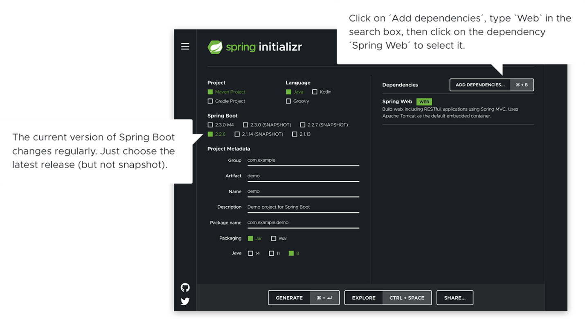

#**_Spring Boot Overview:_**
>>It is a framework that gives us needed resources to build up an application.

**Application of Spring Boot:**
>Spring Boot can be applied and used in different ways like; If we need security, we can use security model available, logging integration, connecting to database (mongo dB, MySQL, etc.), is easy to learn, production ready, can build microservices, dependency injection, configuration, Great community and many more.

[_Link for beginner to start using Spring Boot_](https://spring.io/quickstart)

---

**Steps to follow:**
1.	Choose one Integrated Developer Environment (IDE) and Install it.
2.	We need JDK (Java Development Kit), Install the correct version.

After the above two steps, you are ready to start new Spring Boot project.

Use this link (start.spring.io) to create a “web” project.

In the “Dependencies” dialog search and add the “web” dependency as shown in the screenshot show below.
>

_Hit the “Generate” button, download the zip, and unpack it into a folder on your computer._

After this, open this folder from your IDE and add your code or you can copy and paste the code from the mention website.

Then we can run the program from IDE terminal by giving the following command:
1.	For MacOS/Linux Users:
>./mvnw spring-boot:run

2.	For Windows Users:
>Mvnw spring-boot:run

Then open your browser and typed the http://localhost:8080/hello.

If you have followed the steps from mention website, then you will be able to see **Hello World!** 

You can check: http://localhost:8080/hello?name=Younten%20Tshering
_Output will be:_
**Hello Younten Tshering!**

--- 

_**To make perfect readme file try the following link:**_
https://commonmark.org/help/tutorial/

We can view the preview side-by-side with the file you are editing and see changes reflected in real-time as you edit.

>Press **Ctrl+k** then **V**

_Will be updating the readme file when I learn more._

Thank You
