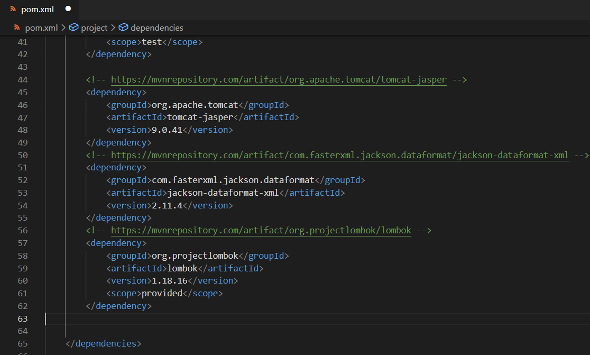
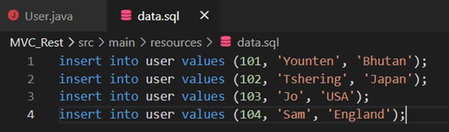

># **_Design Patterns and Spring Boot_**

>## Adding dependencies
First, initialize a Spring starter boot project as usual.
Add the following dependencies:
1. h2
2.	web
3.	jpa
4.	lombok (builder)

Lombok is a handy dependency for giving you the ability to get setters and getters, without getting any boilerplate code.

_**To install lombok in VSCode, add from Extension not by downloading and installing.**_

Then add this dependency into your pom.xml.  
* Search maven repositories for lombok - make sure to use the same version as your lombok.jar. Paste the dependency into the pom.xml
* Similarly, do it for tomcat jasper and jackson dataformat xml 

For more details, check the link given below and follow the readme file till step 2.
https://github.com/YountenTshering/AT70.18_HomeWork/tree/master/Lab1_Finish%20the%20guide

>## Add model:

> Inside src/main/java

1.	Create a 3 package (name such as com.example.DesignPatterns.model)
2.	Inside model package, create a model called User.java with fields of eid, name, and nationality; create setters/getters; and toString

For Creating Setters/getters and toString: Right-Click => source action => generate what we want and select accordinly.

Make sure you mark the class as @Entity so it can work with database, and @Id on top of id to inform the database that it is the primary key

_Remember Model is basically a code representation of your database table/schemas._

> Inside src/main/resources

Create a sql file called data.sql with several insert queries of users.

> Inside application.properties, put the followings:

spring.h2.console.enabled = true 
spring.datasource.platform = h2 
spring.datasource.url = jdbc:h2:mem:mydb

_The above code will allow the program to access a in-memory database called h2._

### Design Pattern are of three different categories namely:

**Creational**
- Provide a way to create objects while hiding the creation logic.

**Structural**
- Concern Class and object composition

**Behavioral**
- Concern with communication between objects
## Now we are ready to try patterns.

> #### i. BUILDER

Before this we should have created a package to hold model and user.java.
There are two methods:
a. Without lombok
b. With Lombok

Here, I have implemented method with Lombok since we notice that User.java has many “boilerplate” code, and we can make it more clean by using Lombok.

To make use of Lombok, put annotation of @Builder to User.java class.  

This will automatically generate builder function, as well as constructor.
If you require getters and setters, you can also put @Getter and @Setter.  

To demonstrate it work, Create BuilderController.java.  
Create function getUser1() and use User.builder() which is created automatically by lombok

Try it with postman to see the output:

Terminal output:

>#### ii. FACTORY
A. Under the model package, create a Role.java interface.  

B. Next, create some concrete role Admin.java and Member.java

C. Under the model package, create the factory RoleFactory.java that handles the creation

D. Last, under the controller package, create FactorController.java

E.Test the factory by running the Spring Boot, and test using the postman.  After clicking “Send”, you will receive the response inside the postman

F.The console output with both admin and member after postman:
