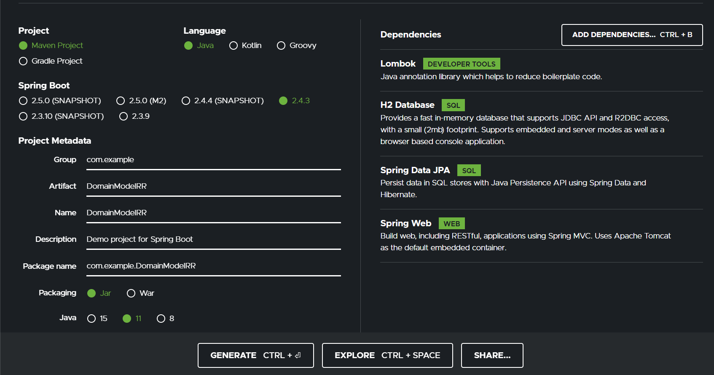
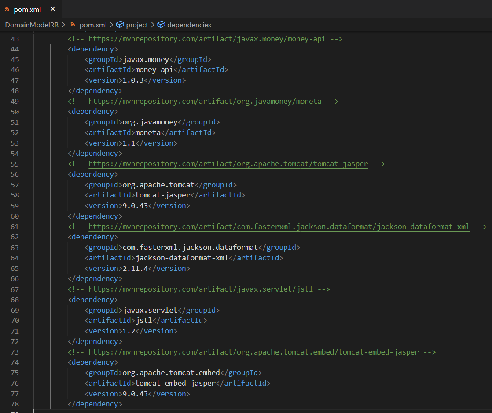
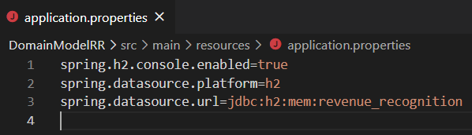
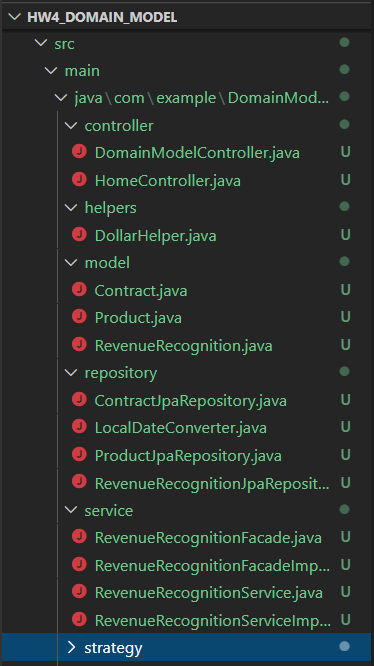
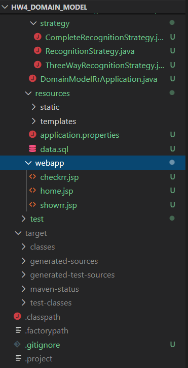

># Domain Logic and Data Source

A simple web application for revenue recognition. At the end, users should be able to:

1. add contract which would insert revenue recognition, and
2. calculate recognized revenue as of some date

**Two approaches:**

1. Transaction Script with Table Data Gateway

**2. Domain Model with JPA**

># PART 2: DOMAIN MODEL

**Here we will be implementing the same revenue recognition from HW4_Transaction Script, we will be replacing our scripts with domain model logic. In addition, we will be replacing our gateway with JPA.**

>### Dependencies

1. Create your spring boot starter project with the following dependencies:

2. A side from these dependencies, make sure you install these additional dependencies from maven repositories

- Money-api and moneta - for working with currency file
- Tomcat jasper - for working with jsp file
- Jackson xml - in case you would like to work with xml file
- Jstl - for rendering ModelAndView objects in jsp files

>### Inside application.properties

Set up the application properties for your datasource

> For code follow the link: 

https://github.com/YountenTshering/AT70.18_HomeWork/tree/master/HW4_Domain_Model/DomainModelRR

># Models

>### Inside src/main/java

*Create package model with Product.java, Contract.java and RevenueRecognition.java*

1. Product.java

- Notice the use of @Transient which indicates the variable that will not be included in the database
- Also notice @PostLoad which indicates the method that needs to be executed after find/query the object

2. Contract.java

- Note that JPA will not persist static final, so it’s fine to include CURRENCY
- Similarly, we will be using @Transient for fields that will not be included in the database
- Note @OneToMany which uses CascadeType.ALL + orphanRemoval = true to make sure all revenue recognitions will be removed if its associated contract is removed
- Note that to keep BigDecimal revenue_ (which persist in Database) and MonetaryAmount revenue (which is used as object for money) consistent, we put this conversion on PrePersist and PostLoad

3. RevenueRecognition.java

- Note fetchType is set to Lazy, so it does not require to load all revenue recognition until it is needed
- Similarly, PrePersist and PostLoad keeps amount consistent between Monetary and BigDecimal

># Repository / Dao

>### Inside src/main/java

*Create package repository with ContractJpaRepository.java, LocalDateConverter.java, ProductJpaRepository.java and RevenueRecognitionJpaRepository.java*

># Helpers
>### Inside src/main/java

*Create package helper*

There is one problem we need to solve, that is, notice that in our RevenueRecognition model, we have a field type LocalDate.  Unfortunately, Jpa does not know how to automatically convert LocalDate to sql date.  Fortunately, JPA is implemented with a default AttributeConverter interface which we can create a class to implement this interface, and define the rules to convert LocalDate to sql date

> LocalDateConverter.java

- Note @Converter(autoApply=true) which makes sure this converter will apply to any LocalDate or any type define in the AttributeConverter<ConvertedFrom, ConvertedTo)

># Recognition Strategy

>### Inside src/main/java

*Create package strategy*

Let’s implement the strategy pattern which will be later used.  We first create an interface, and then implement two concrete implementations.

1. RecognitionStrategy.java
2. CompleteRecognitionStrategy.java
3. ThreeWayRecognitionStrategy.java

># Services

>### Inside src/main/java

*Create package service*

We will be creating some facade to help in general logic, and service to help implement business logic.  You can imagine this facade to be a thin layer, while the service is implementing the actual business logic

1. RevenueRecognitionFacade.java
2. RevenueRecognitionService.java
3. RevenueRecognitionFacadeImpl.java
4. RevenueRecognitionServiceImpl.java

- Note the use of @Transactional which is needed for inserting information into Revenue Recognition tables on calculateRevenueRecognition method.  Try comment and see the effect.
- If you decide not to use @Transactional, then calculateRevenueRecognition require a save method

># Controllers

>### Inside src/main/java

*Create package controller*

Finally, we need to change a few lines of code but as you can see, since our implementation is mostly based on interfaces, only a few lines of code has to be changed on the client side.

1. - DollarHelper.java - no change
2. HomeController.java
3. DomainModelController.java

- With JPA, it can automatically return a list of objects, thus you can avoid all those difficult-to-read code in Transaction Scripts
># Views

- Home.jsp
- Checkrr.jsp
- Showrr.jsp

All the code for above is found in : https://github.com/YountenTshering/AT70.18_HomeWork/tree/master/HW4_Domain_Model/DomainModelRR

The whole directory structure will be like:

># Outcome of code:
