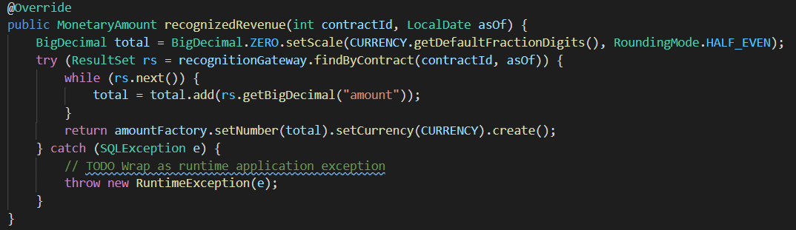
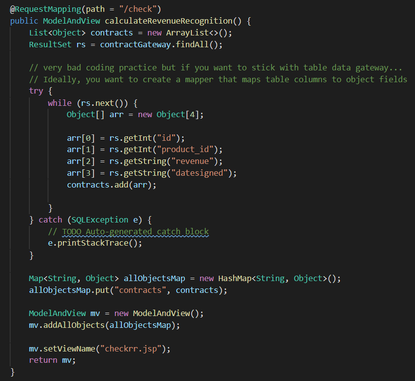

># Domain Logic and Data Source

Simple web application for revenue recognition. At the end Users should be able to:

1. add contract which would insert revenue recognition and 
2. calculate recognized revenue as of some date

**Two approaches:**

**1. Transaction Script with Table Data Gateway**

2. Domain Model with JPA

># PART 1: TRANSACTION SCRIPT

>### Adding Dependencies

1. Create your spring boot starter project with the following dependencies:

- Lombok - for reducing boilerplate code
- JDBC API - api for database interaction
- Note that we are not using JPA but JDBC, to demonstrate table data gateway
- H2 - in-memory database
- Spring Web - provides controllers and MVC support

2. Aside from these dependencies, make sure you install these additional dependencies from maven repositories:

- Money-api and moneta - for working with currency file
- Tomcat jasper - for working with jsp file
- Jackson xml - in case you would like to work with xml file
- Jstl - for rendering ModelAndView objects in jsp files

>### Inside application.properties

Set up the application properties for your datasource

>### Create a Script Package inside src/main/java:

1. First, create RevenueRecognitionScript.java

2. Then, create our concrete implementation RevenueRecognitionScriptImpl.java

- Note that we will be creating gateways
- Also note that we are using money api (e.g., Monetary)
 

> Add constructor:
 

> Add recognizedRevenue method:

- Note findByContract which we will be implement later on on our recognitionGateway
 

> Add calculateRevenueRecognition method:

- Note the use of factory to create suitable revenue recognition strategy (here we are not using any strategy pattern - see Domain Model part)

> Add some basic insert functions:

># Data Gateways:

>### Create a tablegateway package inside src/main/java:

1. Now let’s create data gateways.  

- Note that my data gateways have many duplications that can be better refactored  

> AbstractTableDataGateway.java

- Note on DataSource which is provided by JDBC API and automatically search the database for you

> ProductTableDataGateway.java

- Annotation @Repository is used

> ContractTableDataGateway.java

> RevenueRecognitionTableDataGateway.java

>## Create a helpers and factory packages inside src/main/java:
We will be making two helper classes - RevenueRecognitionFactory.java in factory package which will help insert revenue recognition based on type, and DollarHelper.java in helpers package which will help us create the money
 

 
>## Create a controller package inside src/main/java:

1. Now we will be making two controllers - ScriptController.java which will handles business logic, while HomeController.java will be handling direct request from client

> ScriptController.java

- First, we will be autowiring our RevenueRecognitionScript which contains all our business logic, and our DollarHelper
 

- Second, we will have method for adding contract addContract(), at the same time, calculate revenue recognitions and insert to recognition table accordingly
 

- Method for checkRecognizedRevenue which will return a ModelAndView to showrr.jsp
 
 

> HomeController.java

- We shall create the HomeController which will render the web UI for users to interact, which the UI will in turn route the request to ScriptController.java
- First, we will be autowiring some gateways so we can find some info to show to the web UI

- Next, we will be making our / path which will allow users to add contracts.  For this page, we will be getting info from productGateway and show to the web UI, in order for users to create contract for particular product

- Next, we will be rendering a page for checking revenue recognition until a certain date.  We will be getting information using ContractTableDataGateway to allow users to select their desired contract for checking

 

># Views

1. Last step, we shall create the jsp files.  Note that I am using jstl to render the objects pass from the controllers.  
Also note that you are required to include the “taglib” above the html for jstl to work

> Home.jsp

> Checkrr.jsp

> Showrr.jsp
 

All code found in: https://github.com/YountenTshering/AT70.18_HomeWork/tree/master/HW4_Transaction_Script/TransactionScriptRR

The directory structure will be like:

># Outcome of code:
