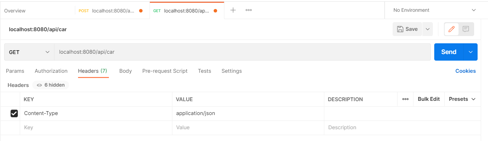

># Multi-Thread and CompletableFuture

Here we will write asynchronous, non-blocking and multi-threaded code.

The Future interface which was introduced in Java 5, to handle asynchronous computations. But, this interface did not have any methods to combine multiple asynchronous computations and handle all the possible errors. The CompletableFuture implements Future interface, it can combine multiple asynchronous computations, handle possible errors and offers much more capabilities.

># Dependencies and configurations

1. Create your spring boot starter project with the following dependencies

- Lombok - for reducing boilerplate code
- JPA - for repository pattern
- H2 - in-memory database (feel free to use others)
- Spring Web - provides controllers and MVC support

2. Next, set up the application.properties for your datasource

># Model and repository

Here, use a simple Car model and jpaRepository

> Car.java

> CarRepository which extends JpaRepository

># @EnableAsyn configuration

> AsynConfiguration.java
 

Next, a configuration file regarding how thread work:
- The @EnableAsync annotation enables Spring’s ability to run @Async methods in a background thread pool. 
- The bean taskExecutor helps to customize the thread executor such as configuring number of threads for an application, queue limit size and so on. Spring will specifically look for this bean when the server is started. If this bean is not defined, Spring will create SimpleAsyncTaskExecutor by default which unlimitedly spawn threads for each incoming task.
- setCorePoolSize set the number of threads.
- setMaxPoolSize - When a new task is submitted, and fewer than corePoolSize threads are running, a new thread is created to handle the request, even if other worker threads are idle. If there are more than corePoolSize but less than maximumPoolSize threads running, a new thread will be created only if the queue is full. By setting corePoolSize and maximumPoolSize the same, you create a fixed-size thread pool. By setting maximumPoolSize to an essentially unbounded value such as Integer.MAX_VALUE, allow the pool to accommodate an arbitrary number of concurrent tasks.
- setQueueCapacity is the number of items our threadPool will accept before rejecting them (i.e., throwing exceptions). It depends on what behavior we expect : If one task takes one second to complete, and you have 10 threads, that means that the 10,000th task in the queue will hopefully be done in 1000 seconds. Is that acceptable ? The worst thing to happen is having clients timeout and re-submit the same tasks before we could complete the firsts.

># Service

Make a service layer that implements some async method:

- We first created an @Asyn method to save cars.  This means that this method will run in background, and will only do the callback once it’s done, via the CompletableFuture.completedFuture, which returns a new CompletableFuture that is already completed with the given value
- Here we accept some file as input thus we have define InputStream type as our argument
- We have also created another @Asyn method to get all cars.  To demonstrate that we only have two threads (see setCorePoolSize and setMaxPoolSize), we insert a sleep period for thread.

> CarService.java

># Controller

1. Let’s make our controller invoke some of these services.

We will start with a POST method to invoke saving cars.

- ResponseEntity represents an HTTP response, including headers, body, and status which will be used to indicate success or failures in saving the files
- Multipart is a representation of an uploaded file in received in a HTTP multipart request

> CarController.java
 

- Open your postman, and access the api (localhost:8080/api/car), perform a POST with three “files” along with your car.csv file

- Notice that two threads are accepting the jobs simultaneously without waiting for the results.  But since we have already define the maxPoolSize to 2, the last job has to wait for everyone

- We can also check the H2 to see the table created and data inserted.

2. Now, in the same controller file, let’s add method for GET

- we can attach a callback to the CompletableFuture using thenApply(), thenAccept() and thenRun() methods, for example:
- CompletableFuture.thenApply().thenAaccept.thenRun().exceptionally(throws new Exception()).build()
- we can use the thenApply() method to process and transform the result of a CompletableFuture when it arrives. It takes a Function<T,R> as an argument. Function<T,R> is a simple functional interface representing a function that accepts an argument of type T and produces a result of type R 
- If we don’t want to return anything from your callback function and just want to run some piece of code after the completion of the Future, then we can use thenAccept() and thenRun() methods. These methods are consumers and are often used as the last callback in the callback chain.
- CompletableFuture.thenAccept() takes a Consumer<T> and returns CompletableFuture<Void>. It has access to the result of the CompletableFuture on which it is attached.
- While thenAccept() has access to the result of the CompletableFuture on which it is attached, thenRun() doesn’t even have access to the Future’s result. It takes a Runnable and returns CompletableFuture<Void> -
- The exceptionally() callback gives us a chance to recover from errors generated from the original Future. we can log the exception here and return a default value.

- Now we can attempt to GET the request

- Notice on our console, only one thread is running because we have perform only one job

3. To demonstrate how the thread asynchronously works, modify the GET method to run three jobs.

- Here we created three CompletableFuture jobs to retrieve all cars
- .allOf will wait until all three jobs are done, and then perform join

- Let’s run a get and note our console output

- Note the timestamps of the first two as compared to the last one.  Two thread simultaneously run but the last job has to wait until the threads are free

># The whole directory looks like this:

