># The Optimistic and Pessimistic Locking

Optimistic Locking does not lock out any resources. Instead, it resolves conflict when it finds one.  It uses @version to keep track of any possible inconsistent states of objects.  

Pessimistic Locking locks out resources.  Write lock and read lock are the two most common locks.  In read lock, any other transactions can read but not write.  On the other hand, in write lock, no other transactions can read nor write.   Spring implements pessimistic locking using @Lock at the repository query.

1. Create your spring boot starter project with the following dependencies:

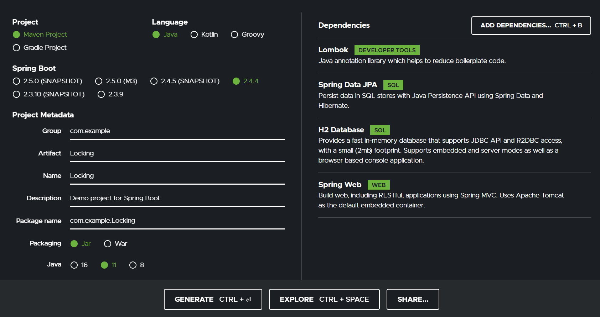

- Lombok - for reducing boilerplate code
- JPA - for repository pattern
- H2 - in-memory database (feel free to use others)
- Spring Web - provides controllers and MVC support

2. Set up the application.properties for your datasource

Notice LOCK_TIMEOUT is specified to 1000ms.  This is informing h2 that or our pessimistic locking, the lock wait time is 1 second.  If the lock wait time is beyond 1 second and is blocking another instance, it shall raise an exception

># resources/application.properties

 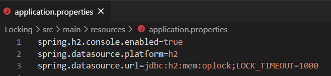

3.	Now create a simple Product model 

Note that we create a variable called version with @version annotation which is of type Long (i.e., numeric)

Whenever the object got updated, Spring will automatically increment this number.  Thus we must never manually set it.  When we manually create any object through data.sql, we must set the version to 0

># Product.java

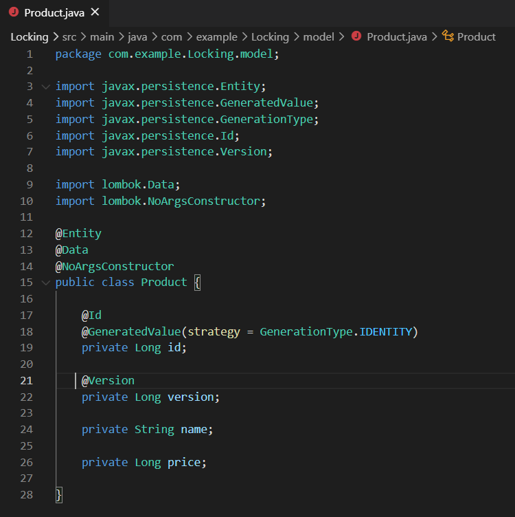
 
4. ProductRepo which extends JpaRepository <Product, Long>

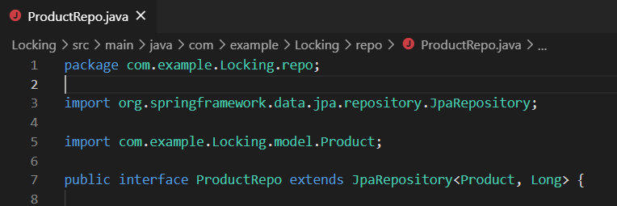

5. Let’s create some controller which would invoke simple CRUD method so we can demonstrate how optimistic locking works

># ProductController.java

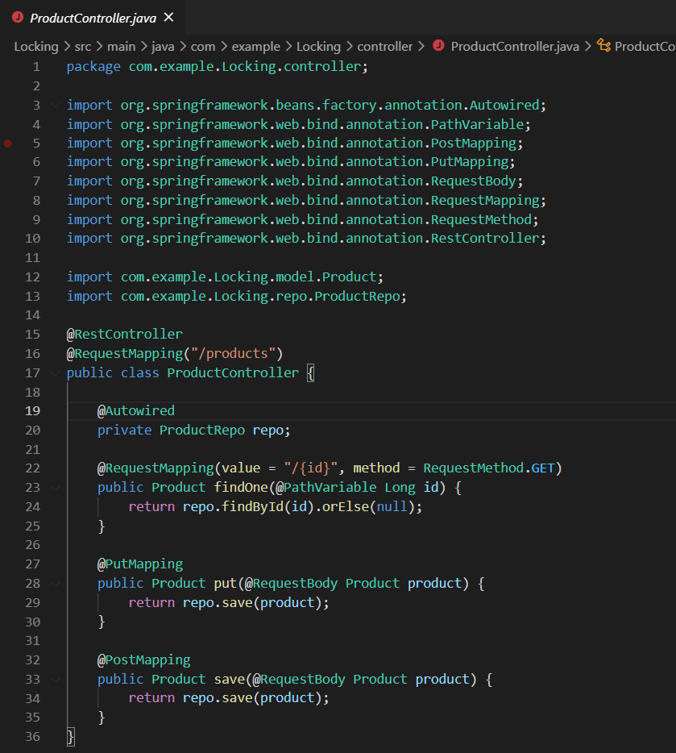

6. To demonstrate how the optimistic locking works, let’s create a simple main program.  Inside the main program file	

a.	First, let’s include two globals - HttpClient so we can make Restful calls to our controller apis, and ObjectMapper, allowing us to transform to json <> java object.  Note that this is really overload, but it’s good for us to know these tools

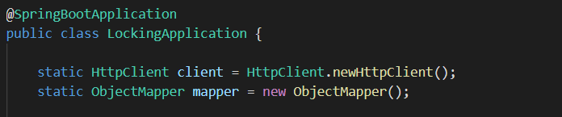

b. Let’s first create method to invoke get

- HttpRequest is a builder wrapper for creating http request, with .uri setting the restful path
- Note we have created method for sendRequest which take HttpRequest as parameter

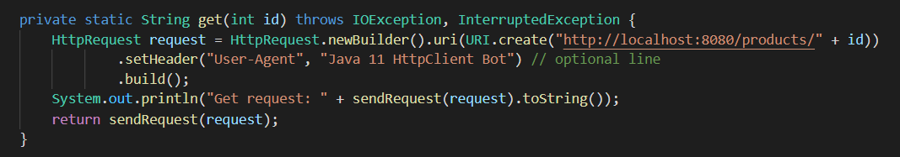

c. Let’ see how the sendRequest looks

- We use HttpClient to send the request, which returns a HttpResponse

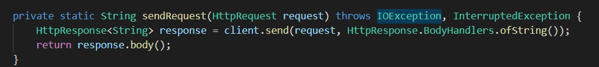

d. Let’s also create method for insert

- First we have created a simple json formatted strings using my own defined makeJSON
- Then call HttpRequest.POST
- Note the header specifying json format, to make sure it will accept my json strings

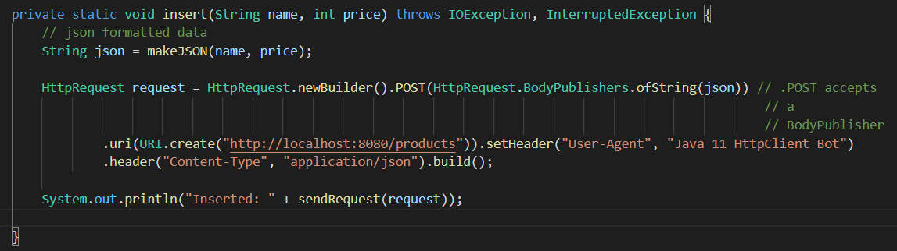

e.	makeJSON is a simple method of creating json strings using Java StringBuilder

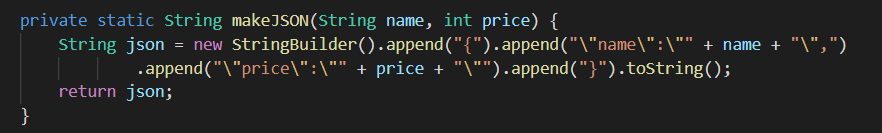

f. Similarly, we have function for converting java object to json as well, using ObjectMapper.writeValueAsString function

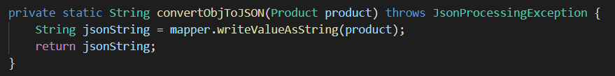

g. Let’s also make one method for update (PUT request)

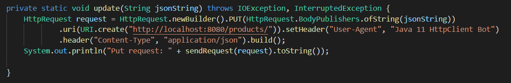

h. Now we are ready to demonstrate the optimistic locking.  Let’s add this to our main program

- We first added some data to our h2 database
- Then we get two copies of the same instance, simulating an concurrent situation
- The first update will pass through nicely
- However, the second update fail, because Spring detects from the version number that is older than the current one

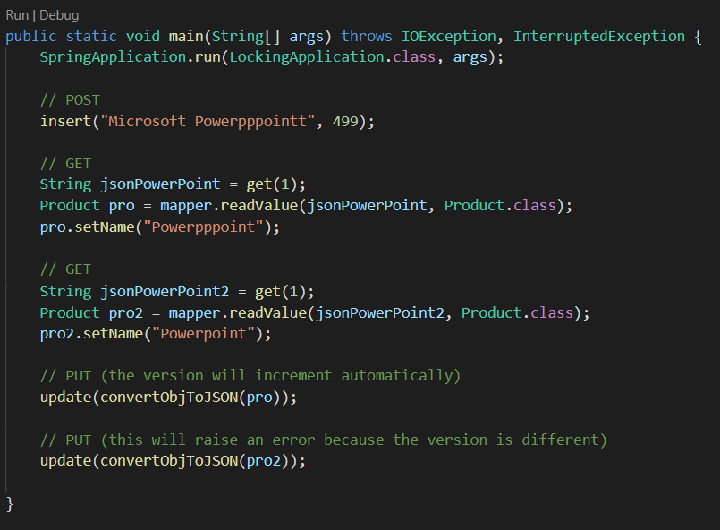

># Output:

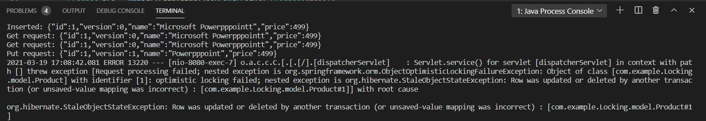

7. Next, let’s work on Pessimistic locking using @Lock.  To simulate a concurrent situation, let’s using @Async to simulate two threads.

- The @EnableAsync annotation enables Spring’s ability to run @Async methods in a background thread pool. 
- The bean taskExecutor helps to customize the thread executor such as configuring number of threads for an application, queue limit size and so on. Spring will specifically look for this bean when the server is started. If this bean is not defined, Spring will create SimpleAsyncTaskExecutor by default.
- setCorePoolSize set the number of threads
- setMaxPoolSize - When a new task is submitted, and fewer than corePoolSize threads are running, a new thread is created to handle the request, even if other worker threads are idle. If there are more than corePoolSize but less than maximumPoolSize threads running, a new thread will be created only if the queue is full. By setting corePoolSize and maximumPoolSize the same, you create a fixed-size thread pool. By setting maximumPoolSize to an essentially unbounded value such as Integer.MAX_VALUE, you allow the pool to accommodate an arbitrary number of concurrent tasks.
- setQueueCapacity is the number of items your threadPool will accept before rejecting them (i.e., throwing exceptions). It depends on what behavior you expect : If one task takes one second to complete, and you have 10 threads, that means that the 10,000th task in queue will hopefully be done in 1000 seconds. Is that acceptable ? The worst thing to happen is having clients timeout and re-submit the same tasks before you could complete the firsts.

># AsynConfiguration.java

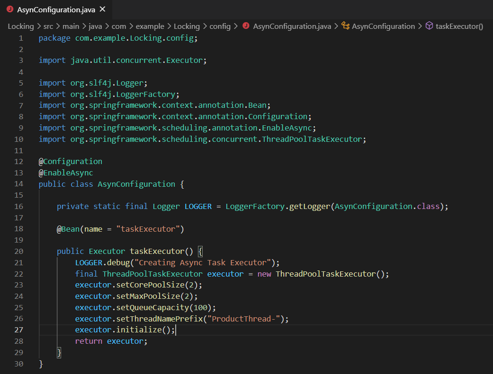

8. Next, let’s apply @Lock to our repository query.  For default api that is created by JpaRepository, if we would like to apply @Lock, we can simply explicitly spell them out, and apply @Lock on top of those apis.

- We have defined two similar queries but the difference is one is using write lock, while another is using a read lock, which are the two most common locks for pessimistic locking
- A PESSIMISTIC_READ lock request fails if another user currently holds a PESSIMISTIC_WRITE lock on that database object.
- A PESSIMISTIC_WRITE lock request fails if another user currently holds either a PESSIMISTIC_WRITE lock or a PESSIMISTIC_READ lock on that database object.

># ProductRepo.java
  
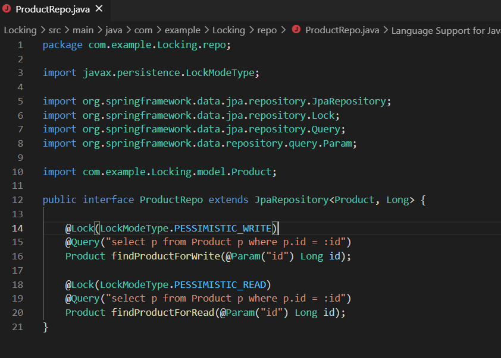

9. Let’s make a service layer that implements some asyn method, so we can test them out

># ProductService.java

- First, let’s autowired our repository
- Then let’s create method for inserting some record into our database

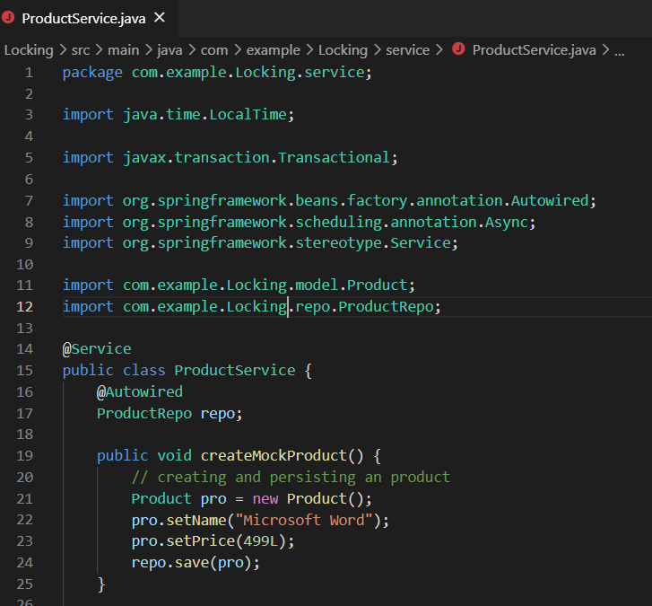

a. Next, let’s create our first transaction

- Here I am reading a product, which acquires a read lock.  Thus any other transaction will not be able to write, until the lock is released (i.e., timeout)

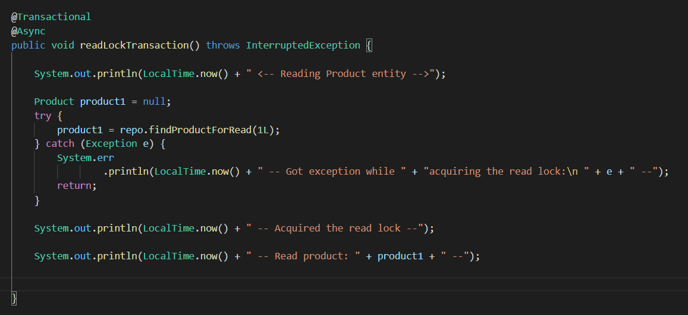

b. Next, let’s create our second transaction

-  Here I am acquiring a write lock, before updating the product and saving it
  
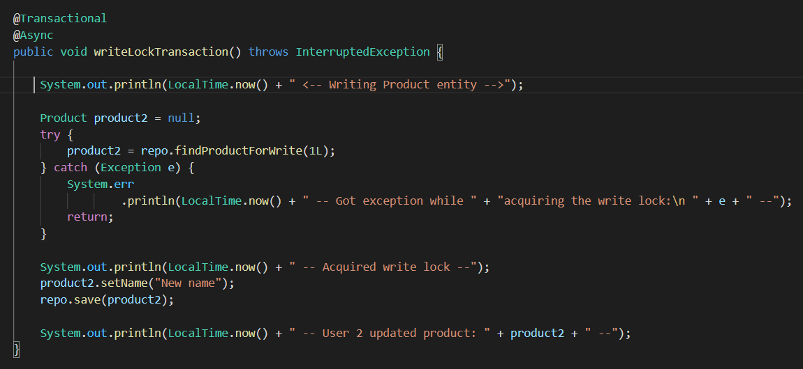

c. Let’s implement a simple main program (separate from the last one) to see the code in action

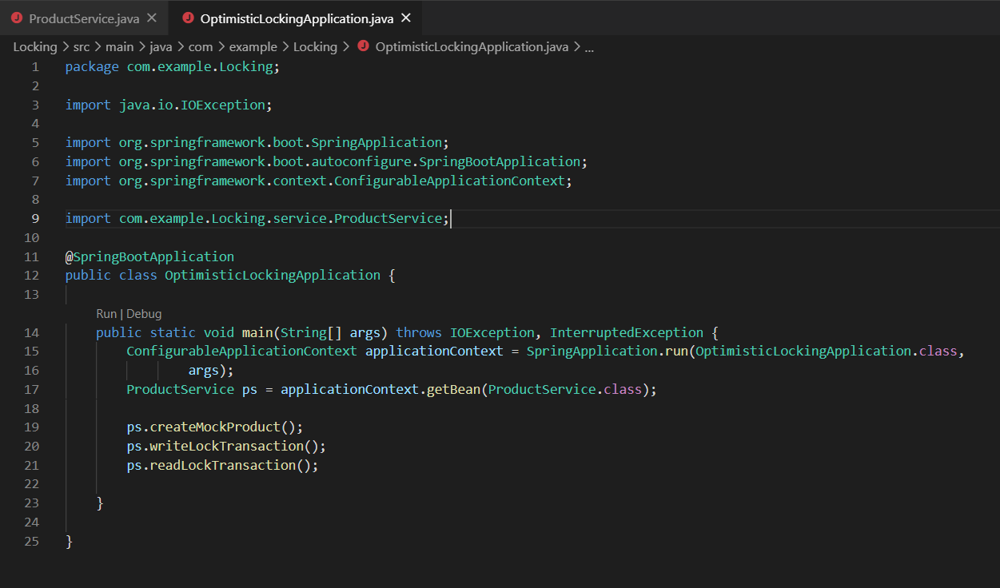

d. In our console, if write lock takes precedence, it will look like this (it really depends on which threads goes first), where read lock can only be acquired once write lock is release at the end of write transaction

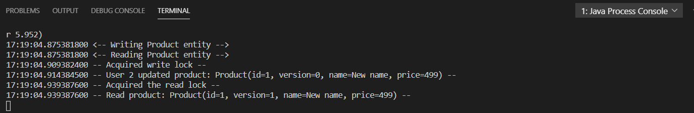

e. In the case where the thread of read lock takes precedence, (we can put Thread.sleep(100L) at writeLockTransaction() like this to force that behavior.

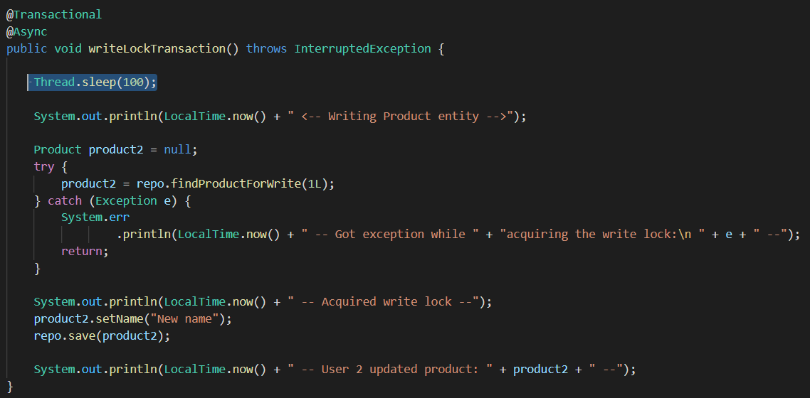

The output will look like this.  Here, the read lock blocks other write locks.

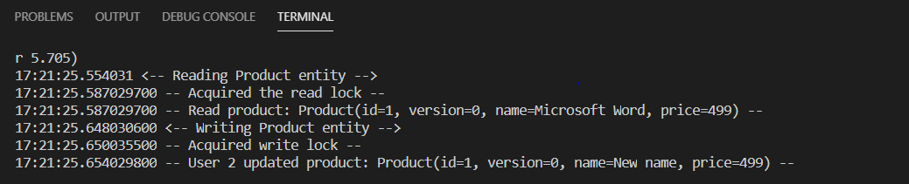

f. If you try to comment @Lock from the Repo and comment out the Thread.sleep(100L) from writeLockTransaction to make sure both threads start the same, the result will be like this:

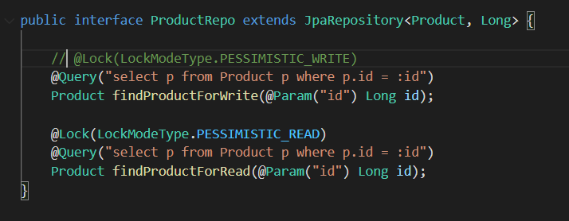

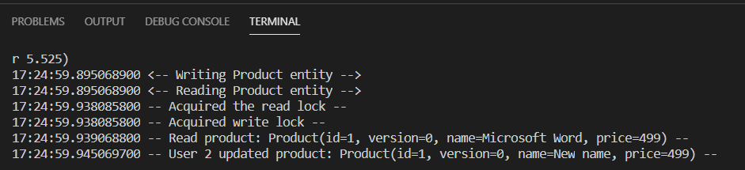

As you can see, it is chaotic, as we never can ensure on the order of read and write, which can lead to inconsistent updates/reads.

g. To show how we can use the timeout to trigger a PessimisticLockingException, put a Thread.sleep(10000L) at the end of readLockTransaction.  As for writeLockTransaction, we will keep the Thread.sleep(100L) at the beginning.  Here we are simulating a case where readLockTransaction will take precedence, but will keep the lock for 10000ms more until the transaction ends.

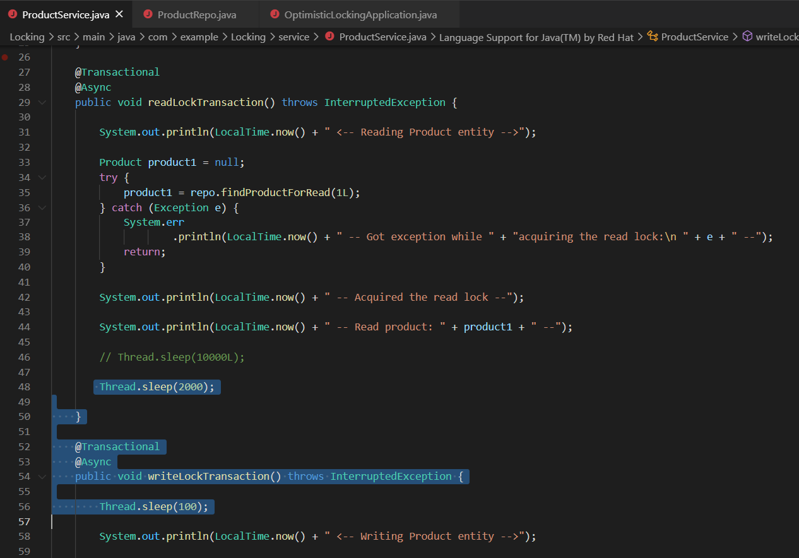

Since this 10000ms greatly exceeds the 1000ms we specify in the application.properties, it will raise an exception, as acquiring the write lock goes beyond the wait time of 1000ms

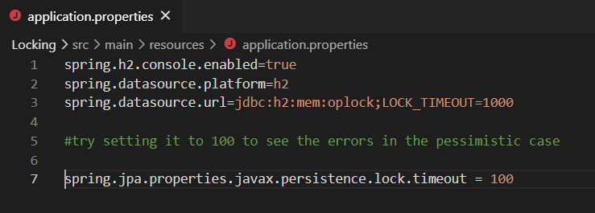

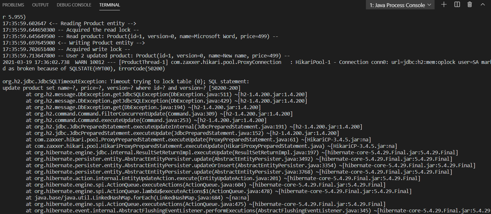

- What we can find is that the locktimeout includes other methods doing something.  For example, if I specify sleep for 2000ms, it will still be fine.  It is suspected that there are a few more second of some methods performing something

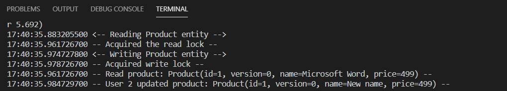
