># Spring Session.

> Use of HttpSession to achieve Session management. 

### Spring Session consists of the following modules:

- **Spring Session Core** - provides core Spring Session functionalities and APIs
- **Spring Session Data Redis** - provides SessionRepository and ReactiveSessionRepository implementation backed by Redis and configuration support
- **Spring Session JDBC** - provides SessionRepository implementation backed by a relational database and configuration support
- **Spring Session Hazelcast** - provides SessionRepository implementation backed by Hazelcast and configuration support

We will be using Spring Session JDBC to store spring session information. By default Apache Tomcat stores HTTP session objects in memory.  Instead of memory, we will be using DB session state.

1. Create our spring boot starter project with the following dependencies:

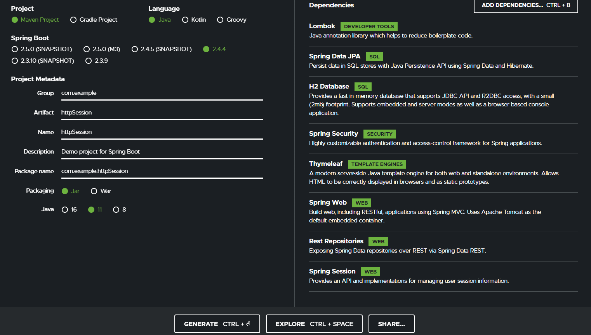

- **Lombok** - for reducing boilerplate code
- **JPA** - for repository pattern
- **H2** - in-memory database 
- **Spring Security** - provides built-in authentication-authorization
- **Thymeleaf** - template engine (we have been using jsp a lot, let’s use another template engine) - html based - provides a lot of logic
- **Spring Web** - provides controllers and MVC support
- **Rest Repositories** - auto configure a restful apis for the model without the need of controllers
- **Spring Session** - provides session support
  - Spring Session Data JDBC

2. There is one more dependency to include in the pom.xml which is session jdbc

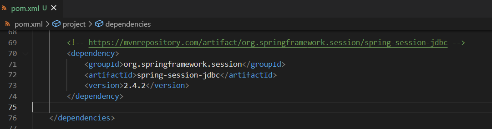

3. Our application properties are simple.  Notice one line is added to make sure Spring Boot implements session under the hood with the datasource defined (which is h2 here)

>### resources/application.properties

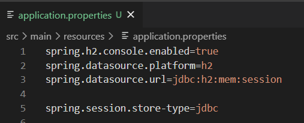
 
1. We will be implementing Spring Security first, to demonstrate that the session is stored inside h2.

>### SecurityConfig.java 

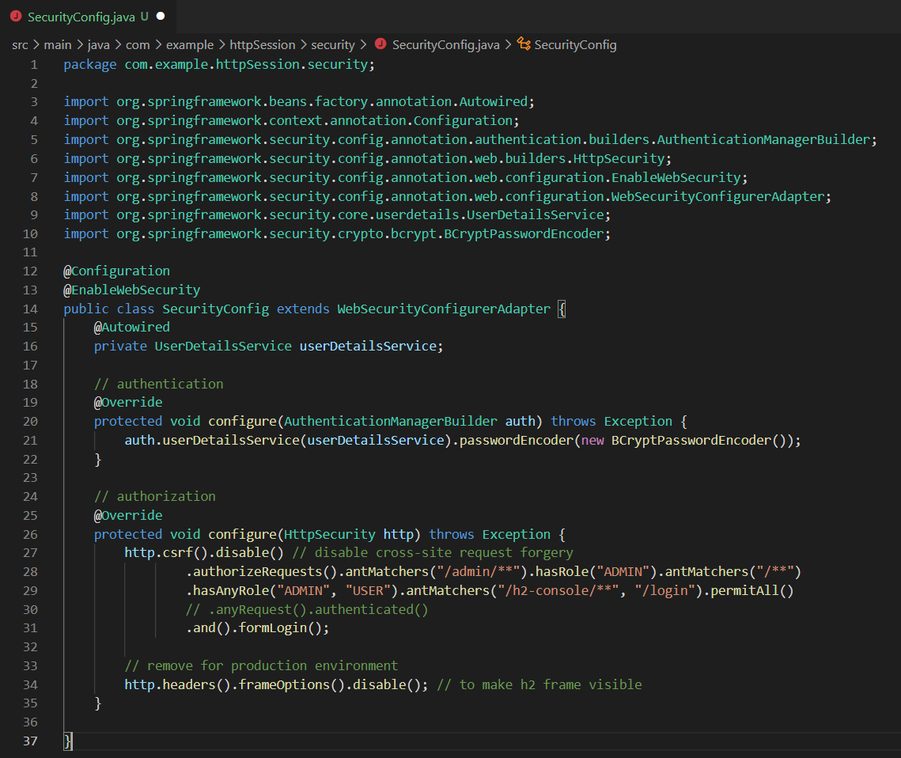

>### MyUserDetailsService.java

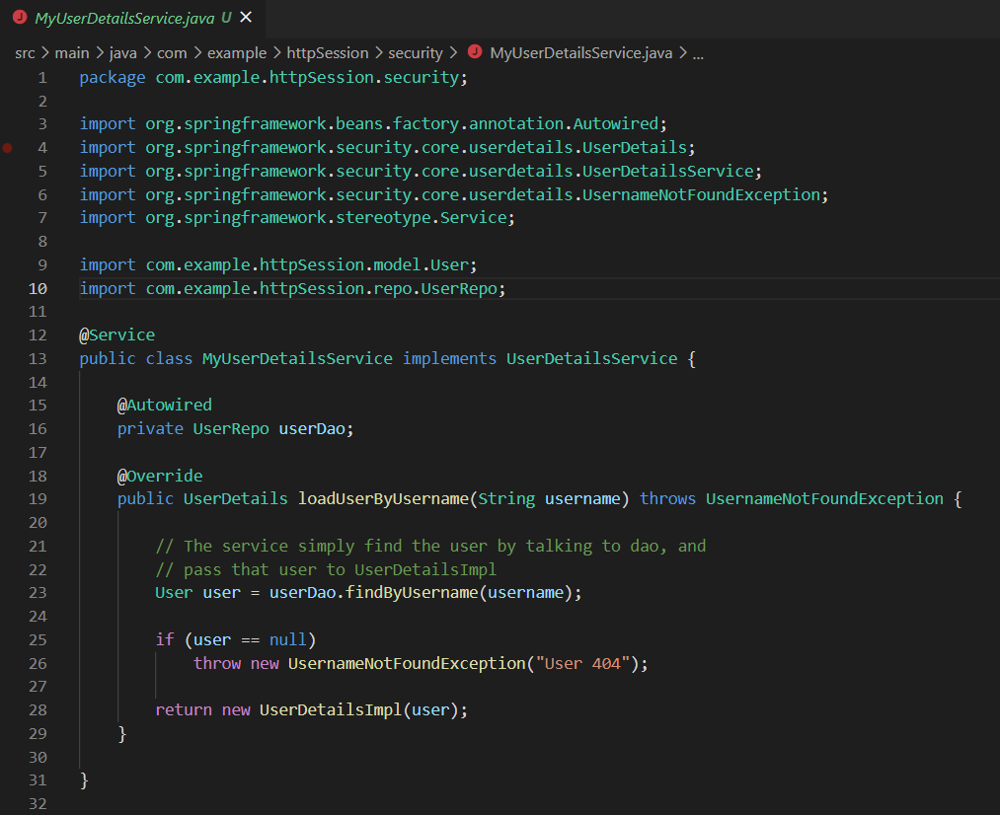

>### UserDetailsImpl.java

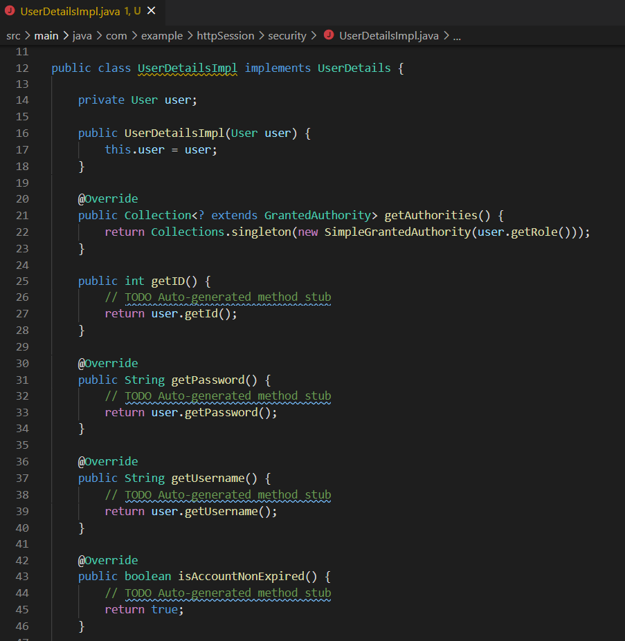

>### UserRepo.java

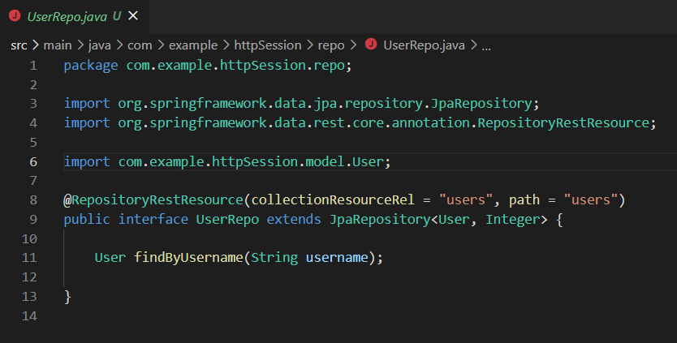

>### User.java

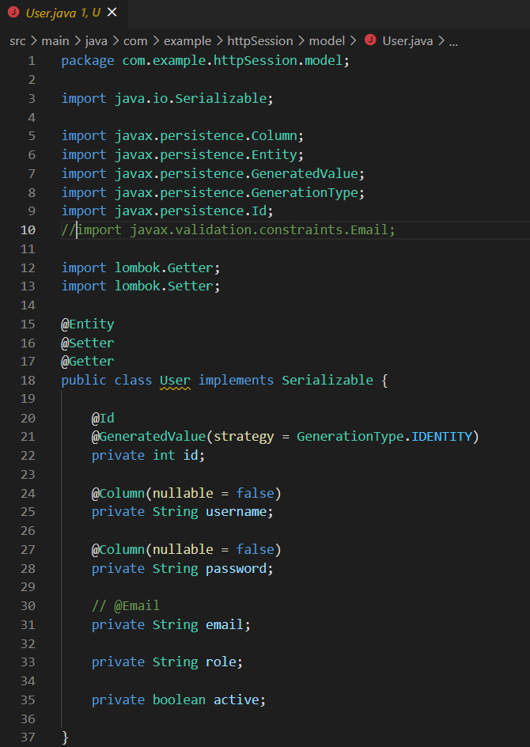

>### data.sql - Make sure we create some users

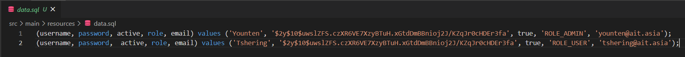

5. Now run the Spring Boot App, login as usual. Go to the h2-console. Notice now that **there are two more tables**.  Spring Session which Spring keeps all the session id variables, as well as Session Attributes which Spring keeps the model attributes:

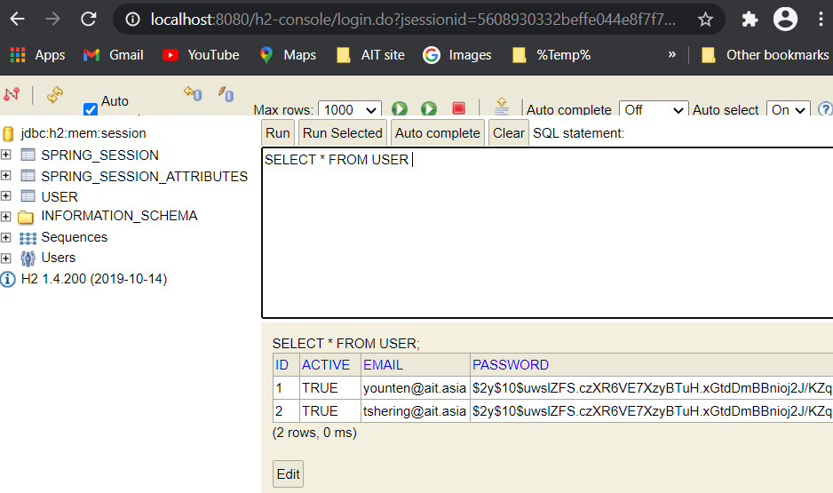

6. Now let’s learn how to manually insert session attributes into h2 database using HttpSession .setAttribute and .getAttribute

>### SessionController.java

- Let’s first create a method for **saving some arbitrary strings** called messages
- Here we are **autowiring HttpServletRequest** to retrieve the session variables.  Note the difference between HttpServletRequest and HttpSession, which can both set and get session attributes.  We use **HttpServletRequest to store data that is specific to a HTTP request** (e.g., through restful apis); the lifetime ends when the request is finished.  We use **HttpSession when dealing with global HTTP session** (e.g., logged-in user, user settings).  The lifetime is until the connection between client/server is closed.
- If the session attribute of MY_MESSAGES is null (i.e., first time), we initialize it.  Then we add msg to the Array List and refresh the page

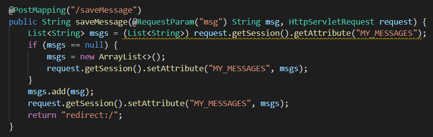

- Let’s add method for showing all messages by retrieving info from the session attributes **using getAttribute**.  Notice we use HttpSession since there is no request incoming. Note that since we are using **index.html** via Thymeleaf engine, thus we do not include .jsp

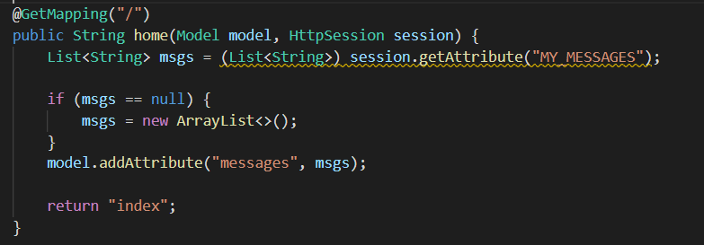

- Last, we shall add method to **destroy all session** attributes using invalidate() method

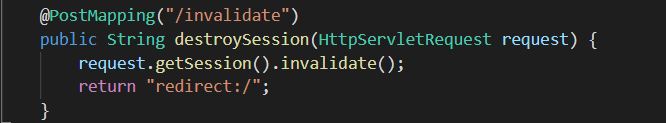

7. Last, let’s create the index page to **invoke the controller** commands.  @ is used to invoke any uri request. $ is used to access any variables being passed by the controllers

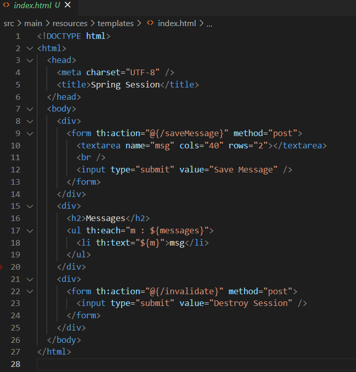

8. Run as a Spring Boot app, and start adding some messages.  Go to h2 and notice on your session attributes table MY_MESSAGES

> Login after running the program:

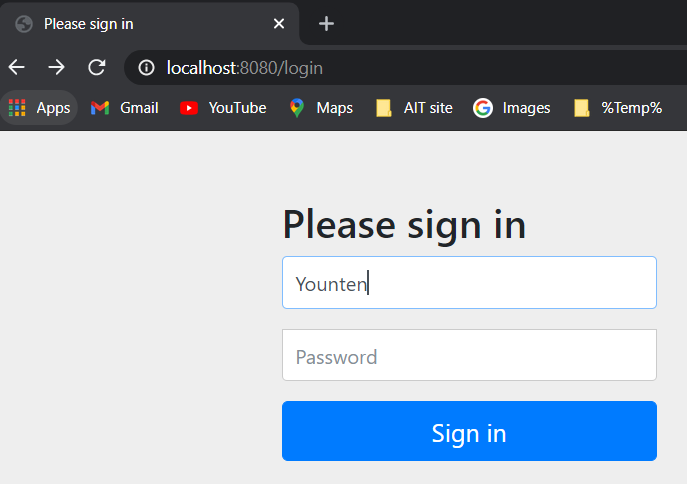

> Adding some messages:

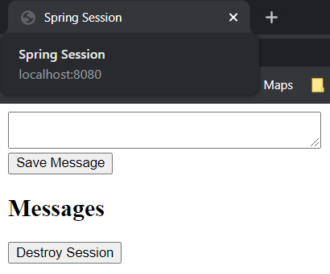

> After adding the messages:

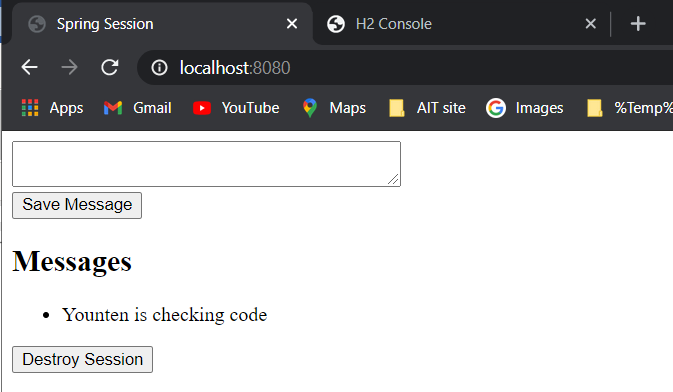

> Notice in H2 on our session attributes table MY_MESSAGES 

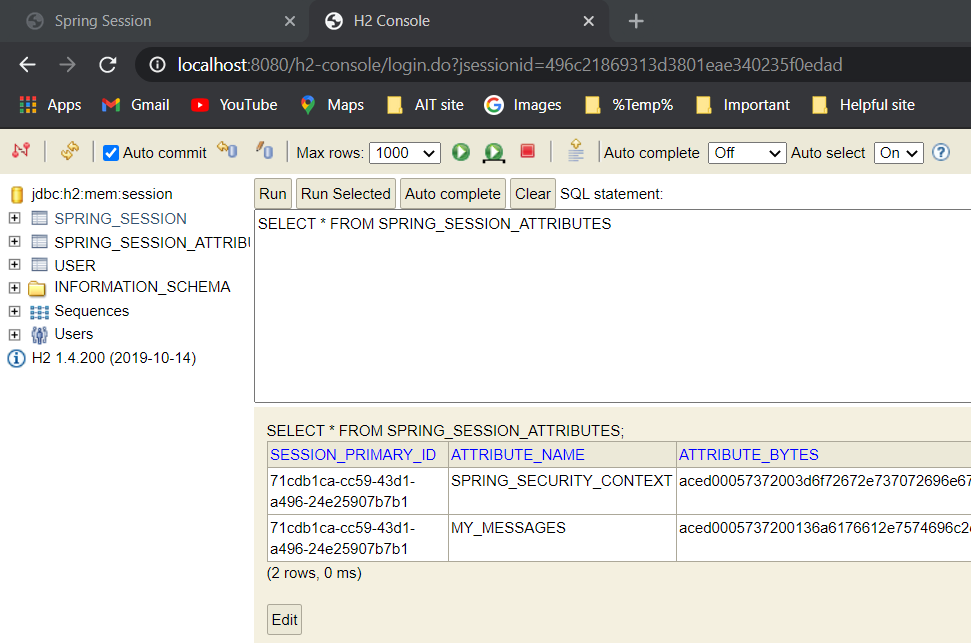

> After Destroy Session

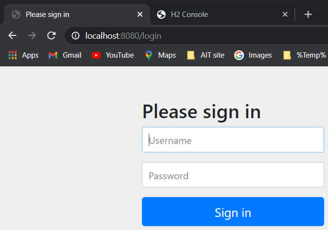

> MY_MESSAGES in session attributes table is deleted

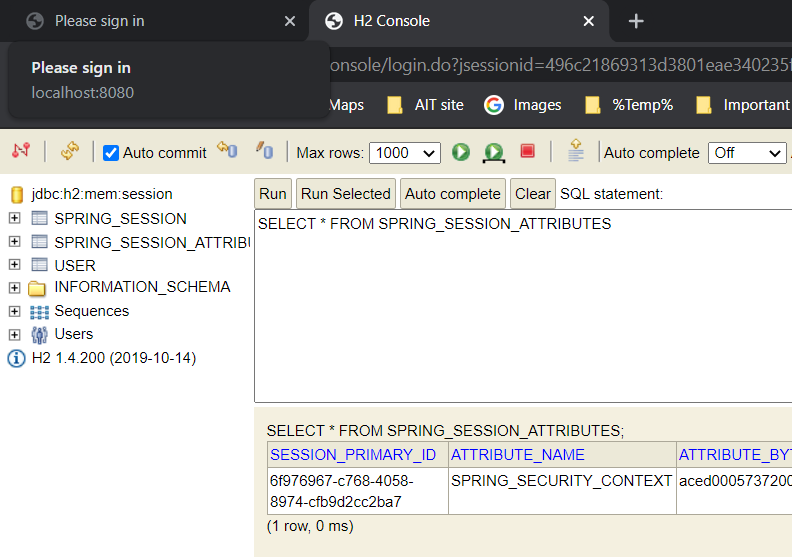

> Spring Session of two different user with different role: 

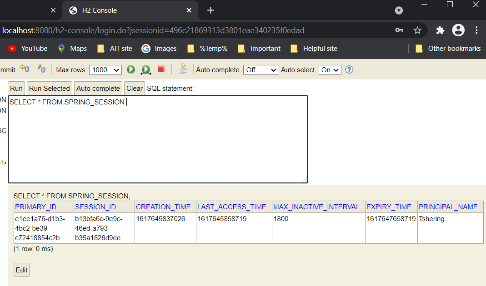

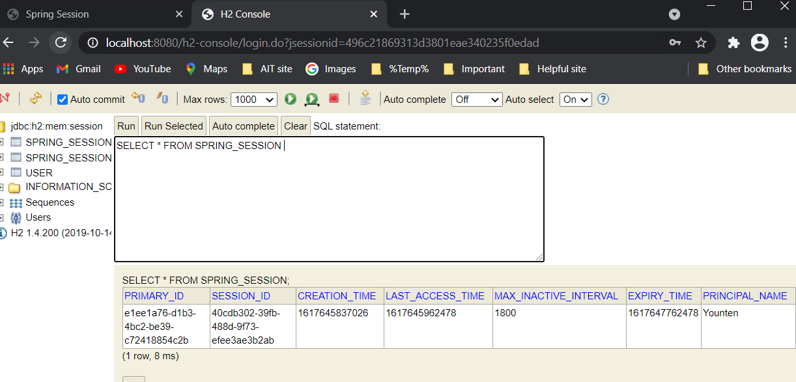

># For the Assignment, please follow the link to see application connect to a Redis and store the session:

https://github.com/YountenTshering/AT70.18_HomeWork/tree/master/HW7_Spring-Session/SessionWthRedis