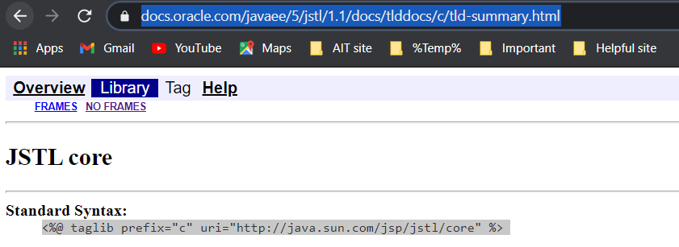

># _RESTful APIs and MVC with Spring Boot_

>## Scenario for this lab work:
1. A model of Employee, with fields of name, gender (enum), address, salary (per annum), value (generate per annum), and position level (int) - 4 as highest
2. Create a view to list all employees with net value (calculated as value - salary) sorted (ascending or descending - either is fine) 
_Red highlight the one with minus net value (use CSS)_
3. On that same view, add icons for edit and delete for each row of employee, which should allow us to actually edit or delete that employee.

---
># _Pre-requisites_
* Make sure you have Spring Boot installed.  You can follow the guide here → https://spring.io/quickstart .
* Install Postman → https://www.getpostman.com/.  This will be a handy testing tool for testing our RESTful calls.
---
># Step 1: Adding dependencies
For VScode: Generate project from https://start.spring.io/
Create your spring boot starter project, make sure you have imported all the dependencies needed as follows:

1. Web → dependency for making web interfaces.
2. H2 → dependency for generating in-memory database for quick testing.
3. Spring JPA → dependency for supporting many common calls to database without writing a bunch of SQL queries

>> Go to https://mvnrepository.com and search for tomcat jasper.  
_Choose the version that matches your tomcat-embed-core version inside the Maven dependencies folder.
**Copy and paste the dependency on your pom.xml.** This dependency allows us to work with .jsp files.  
Similarity, add jackson dataformat xml dependency to your pom.xml file.
**(make sure the version matches to your jackson-core inside the Maven dependencies folder).** 
This dependency allows our RESTful API to work with XML, instead of only json files._

**Note:
After this properly format the code (shift + alt +F) and do not forget to save file.**

---
># Step 2: Adding model

>> **Inside src/main/java**

1. Create a 3 package (name such as model, dao and controller)

 

2. Inside that package, create a model called Employee.java with fields of name, gender (enum), address, salary (per annum), value(generate per annum), and position level (int)- 4 as highest

**For Creating Setters/getters and toString:**
Right-Click => source action => generate what we want and select accordinly.

Make sure you mark the class as @Entity so it can work with database, and @Id on top of id to inform the database that it is the primary key

**_Remember Model is basically a code representation of your database table/schemas._**

>> **Inside src/main/resources**

Create a sql file called data.sql with several insert queries of employees.

>> **Inside application.properties**, put the following code:

spring.h2.console.enabled = true 
spring.datasource.platform = h2
spring.datasource.url = jdbc:h2:mem:mydb

**Note that in the last line of code, you can specify “mydb” to be anything you like but you cannot change “jdbc:h2:mem”**

_The above code will allow the program to access a in-memory database called h2._

Try to launch the app as Spring Boot app, launch your browser, and then go to http://localhost:8080/h2-console 
Put in the specified spring.datasource.url that you have put before and click connect.

_You should have all the employees you have inserted specified in the data.sql_

---
># Step 3: Adding views
Inside your src/main, create a folder called webapp
Create three file and use html and css skill to add employees , delete employees and edit employees.
A. home.jsp
B. add.jsp
C. edit.jsp 
> We also need to make css folder to keep css file.

---
># Step 4: Adding controllers
In order to view this view, we need a controller
> Inside  src/main/java

Inside the controller  package, create a class EmployeeController.java
1. Put an annotation of @Controller on top of the public class so Spring Boot knows it is handling requests
2. public String home()
    - Method to access the home.jsp
    - You are required to put @RequestMapping annotation to indicate the routing protocol of this function.  The path attribute specifies the url relative path, while the method attribute specifies the protocol
    - By returning home.jsp, it will automatically searched in the src/main/webapp folder that we have created earlier

---

># Step 5: Adding DAO
Before we can access the database, we need to create the DAO (Data Access Object) interface
> **Inside  src/main/java**

* Inside the dao package, create a interface EmployeeDao.java
    - Make sure the class extends JpaRepository <Employee, Integer>

_Inside your EmployeeController.java controller_
Create EmployeeDao and should have annotation of @Autowired  (a technique of Dependency Injection that will inject these two variables during runtime)
After the user actions, properly format the code (shift + alt +F) and do not forget to save file.

---
># Output of the lab1 assignment:
For this lab work, I have additional included the adding of employee interface and to genenrate the list of employees we have add the following:

1. JSTL from MVN and add in pom.xml as dependency

2. Add the following code in jsp file(home.jsp)
 
 <%@ taglib prefix="c" uri="http://java.sun.com/jsp/jstl/core" %>

Following are the interfaces made and it's details:

* Main page of the application, where we can view the list of employee and see three icon or button to add or edit or delete employee.

* Form to add the employee with dropdown function to input  the level of employee bewteen 1-4.

* Interface just before the adding of employee and showing the h2-console to verify the insertion. 

* Form to edit the details of employee and updating it.

>### For more details, check comment code. 