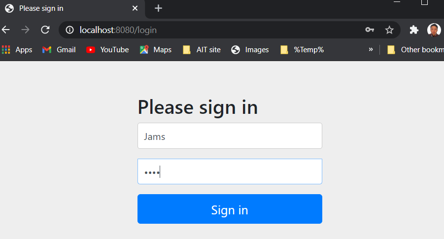
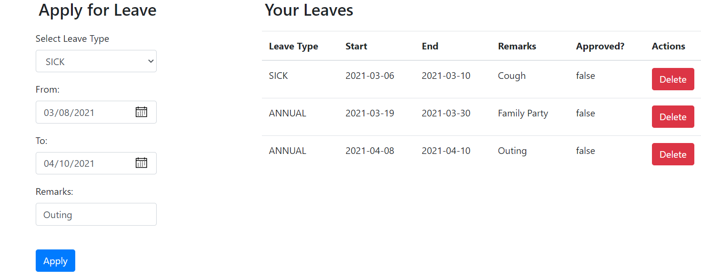
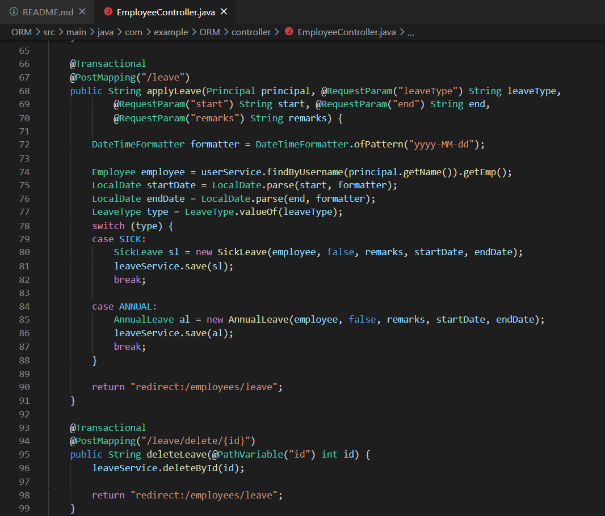
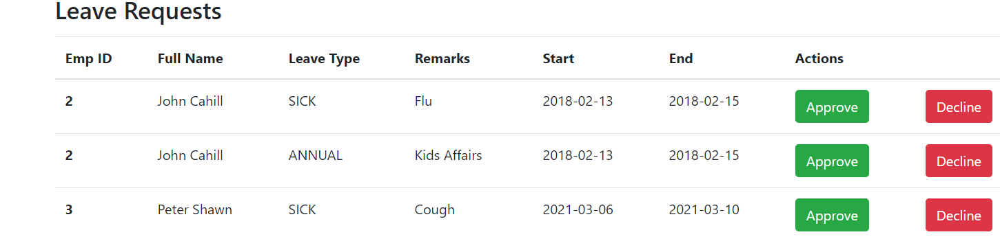
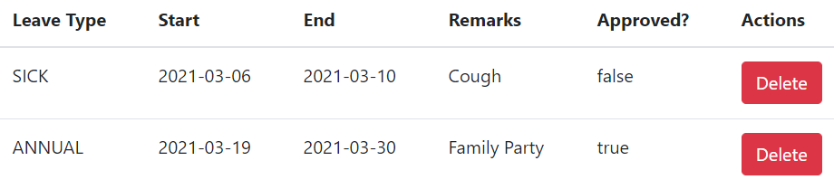

># This is continuous from Take Home Task:
(https://github.com/YountenTshering/AT70.18_HomeWork/tree/master/Lab3_TakeHomeTakes)

**I have made different file in different folder since it is easier to study and see the changes made in file and code.** 

>## H. Extend the app so that user can apply sick leave or annual leave and admin can approve leave.
**Answer:**

> Login form:

> Leave form and status:
> >## apply for leave and view leave details

> In EmployeeController.java

>## Admin power to view leave requests and approve the leave

True for approved and false for not approved.

