># ORM, Hibernate, JPA, and Spring

> For setup follow the link:

https://github.com/YountenTshering/AT70.18_HomeWork/tree/master/Lab3_guide

># Take-home tasks

>## A. Set the employee cache to **20 seconds**, and run the test again.  Look at testCache.  What happens?  Document your findings.
**Answer:**

Set the cache time in **ehcache.xml** as follow:

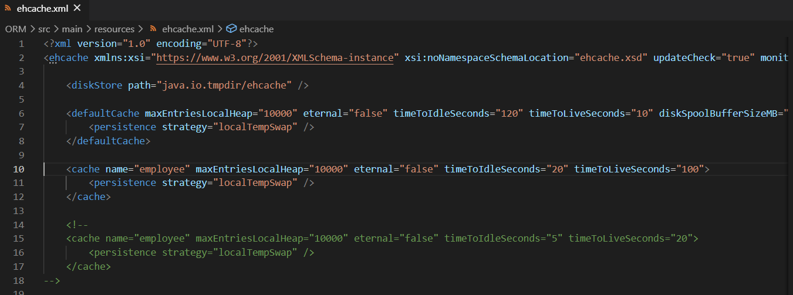

We can notice that after the fetching, it makes query and employee is in cache.
The testcache: does not load the entities after 10 seconds (sleep time) since it is still in cache.

Since the cache time is more than sleep time (10 sec). Therefore, the entities are not loaded in cache and employee is still in the cache, so loads from cache without making Query.

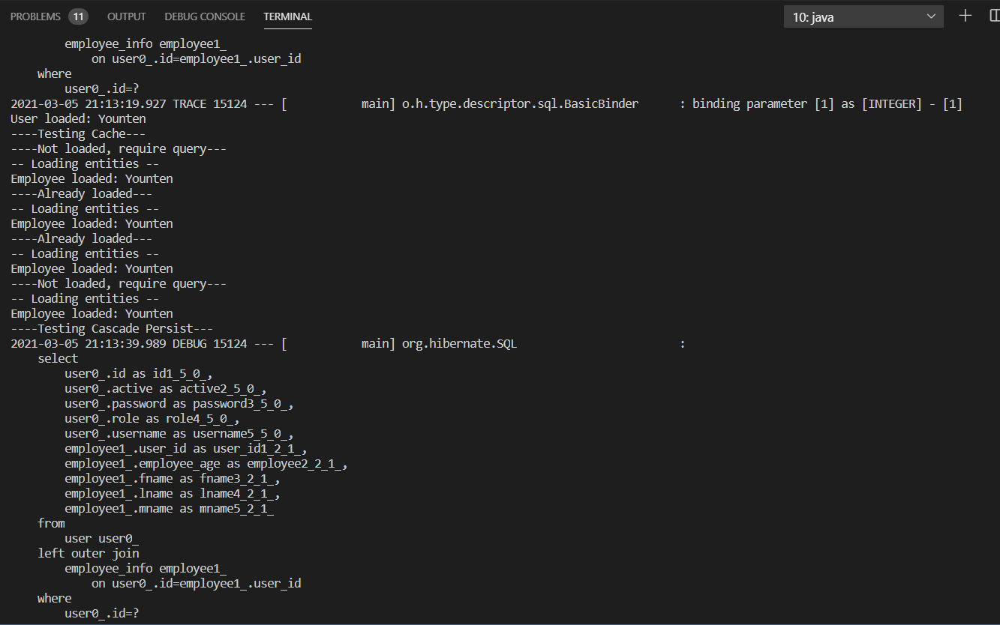

>## B. Attempt to change the code, so that User table has the **foreign key** of Employee
**Answer:**

**Employee table Before Changing** - USER_ID as foreign key:

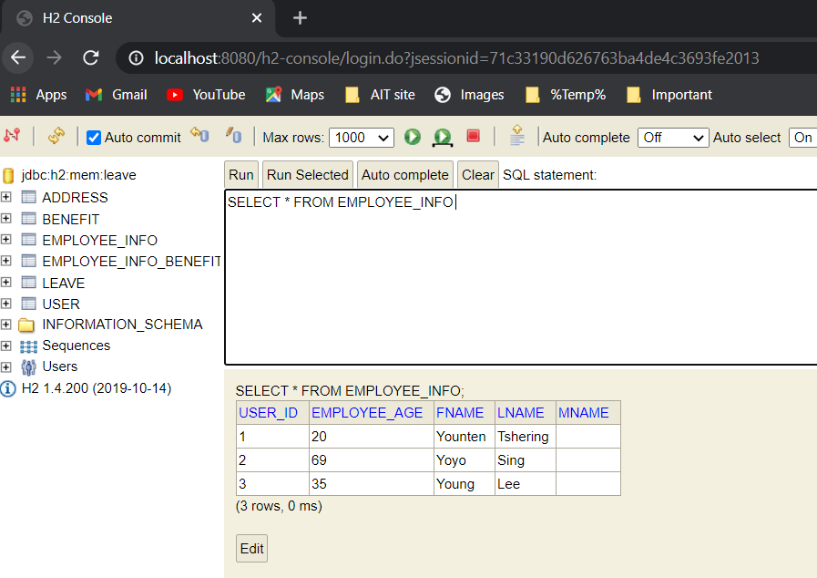

**User table Before Changing**

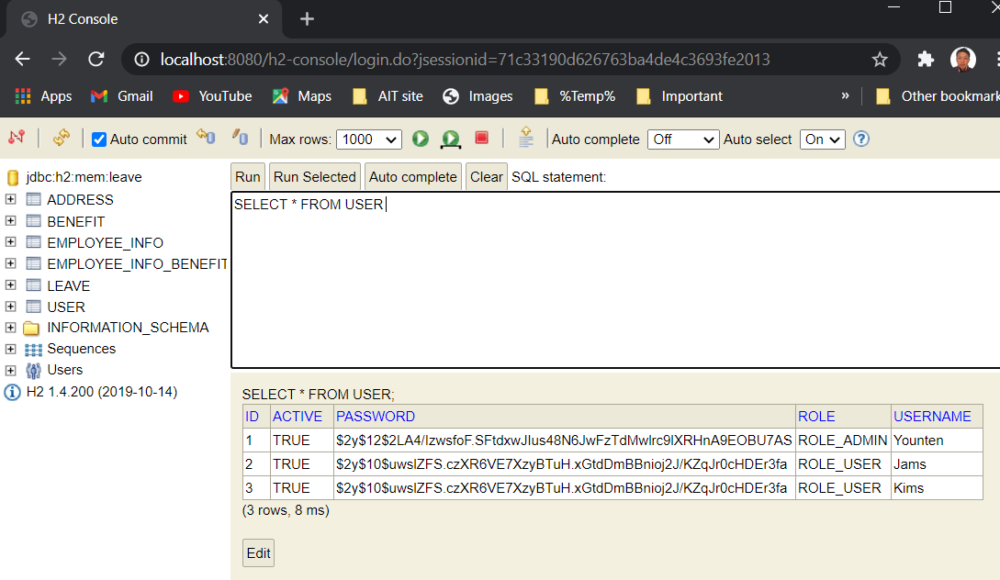

**User table After changing the code** - EMP_ID as foreign key

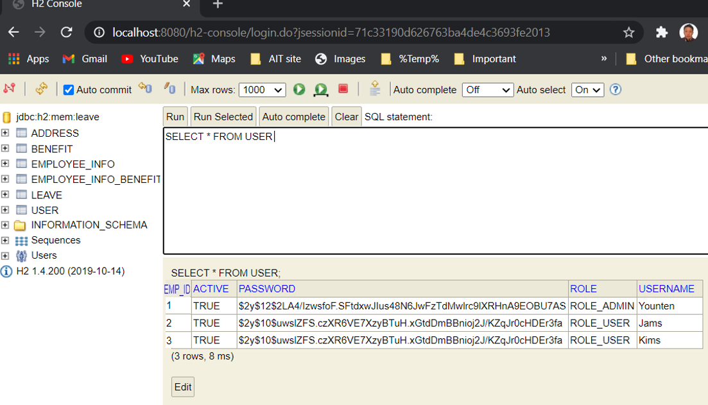

**Employee table After changing the code**

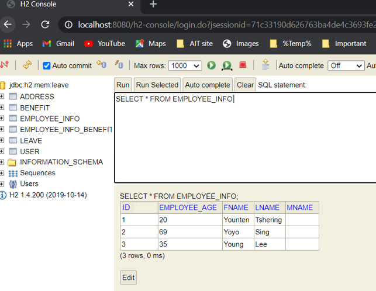

>## C. Research and discuss the difference between **cascade.REMOVE and orphanRemoval=true** (use your own words)
**Answer:**

**CascadeType.REMOVE** is a way to delete a child entity or entities whenever the deletion of its parent happens.
**orphanRemoval=true** is delete orphaned entities from the database. An entity that is no longer attached to its parent is the definition of being an orphan.
**Example:**
When an Employee entity object is removed the remove operation is cascaded to the referenced Address entity object. In this regard, orphanRemoval=true and cascade=CascadeType.REMOVE are identical, and if orphanRemoval=true is specified, CascadeType.REMOVE is redundant. 

The difference between the two settings is in the response to disconnecting a relationship. For example, such as when setting the address field to null or to another Address object. If orphanRemoval=true is specified the disconnected Address instance is automatically removed. This is useful for cleaning up dependent objects (e.g. Address) that should not exist without a
reference from an owner object (e.g. Employee). If only cascade=CascadeType.REMOVE is specified no automatic action is taken since disconnecting a relationship is not a remove operation.

If User has one-to-many relation to Comment. If you are using cascade="remove", you can remove the reference for Comment from one User, and then attach that Comment to another User. When you persist them, they will be correctly saved. But if you are using orphanRemoval=true, even if you will remove given Comment from one User, and then attach to another User, this comment will be deleted during persist, because the reference has been deleted.

>## D. **Remove lazy load** from addresses and benefits, run the testFetch function. What happens?  Document your findings.
**Answer:**

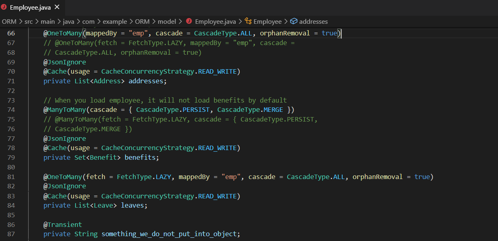

There is no change in the output or while testfetch. Since the fetch and load is done within time to live.

>## E. **Remove cascade = cascadeType.ALL and orphanRemoval = true from benefits and addresses**, run the testCascadeRemove and testCascadePersist function.  What happens?  Document your findings.
**Answer:**

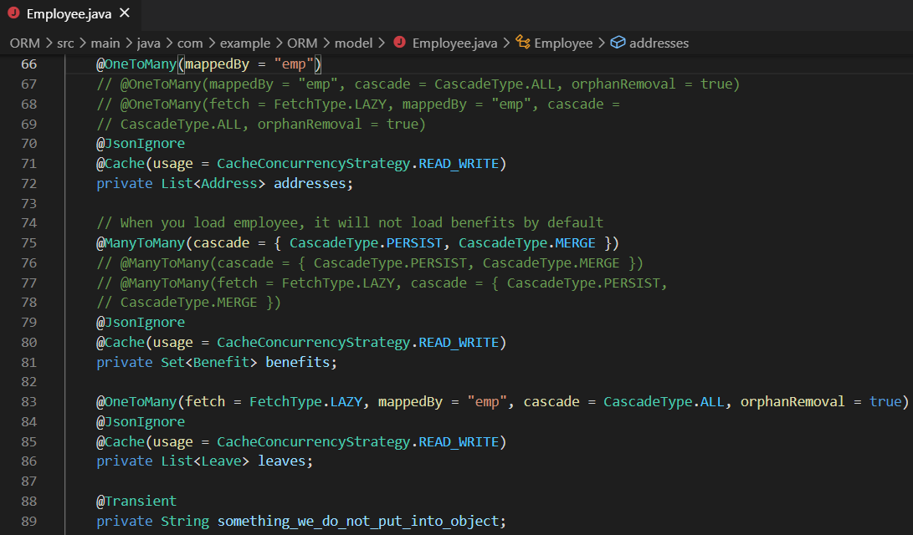

Application runs till persist and address.java throw exception since table are linked.

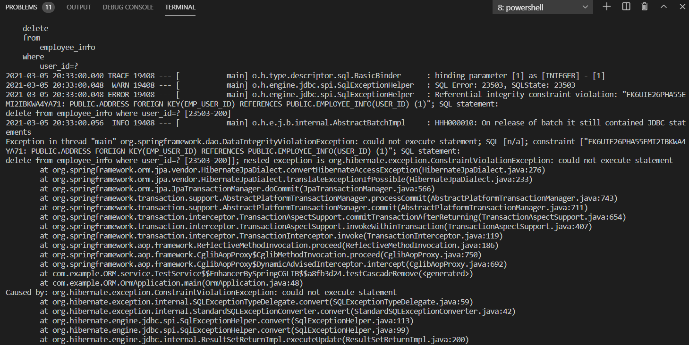
Data in leave table is not inserted (testCreateLeave) since there was no relationship address.

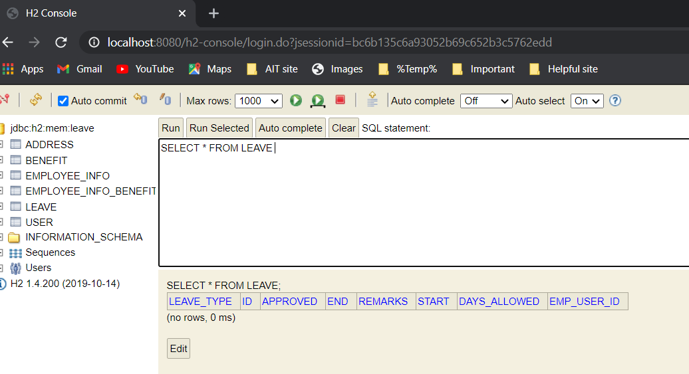

Since the apllication ran till persist and didnot reached testCascadeRemove, the admin Younten is still inside table.

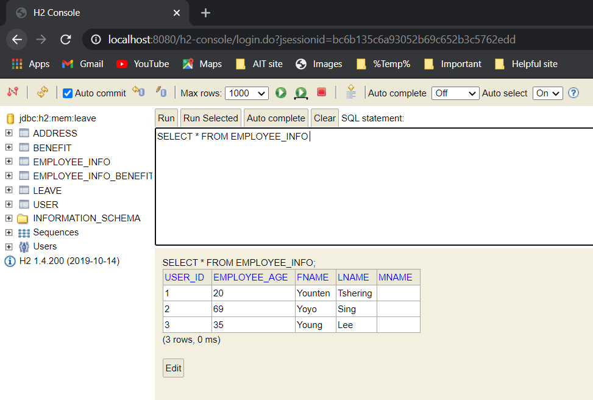

>## F. **Attempt to remove @Transactional** from any of the methods defined in the TestService.java.  There are some errors.  Explain why such an error happens.
**Answer:**

The @Transactional annotation is the metadata that specifies the semantics of the transactions on a method. We have two ways to rollback a transaction: declarative and programmatic. In the declarative approach, we annotate the methods with the @Transactional annotation.

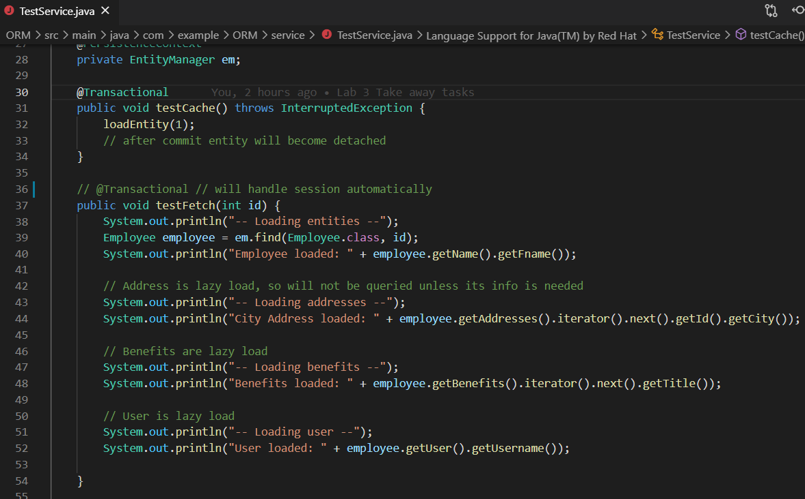

@Transactional will handle session automatically and when it is removed then it will happen like question E.

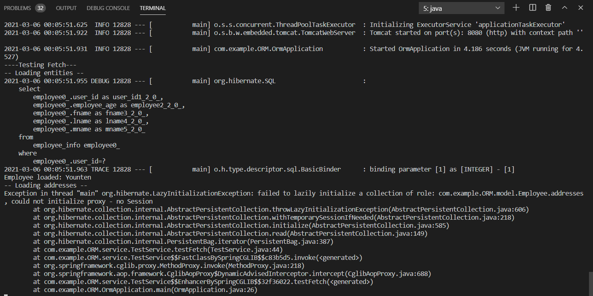

Data in leave table is not inserted (testCreateLeave) since the apllication ran till persist and didnot reached testCascadeRemove, the admin Younten is still inside the table.

>## G. Coding: **Transform** my main program test into unit test
**Answer:**

We need to use JUnit tests concept used liked in singleton.

In Test Fetch, **Assertions** is used to verify the state of entities throughout the program.

**Assertions.assertEquals(expected, actual)**

- This method tests if the actual value equals to the expected value or not.

- Here, I checked employee's name with id 1, to be "Younten", by accessing its getName().getFname() methods.

**Assertions.assertFalse(condition)**

- This tests if the condition provided is false.

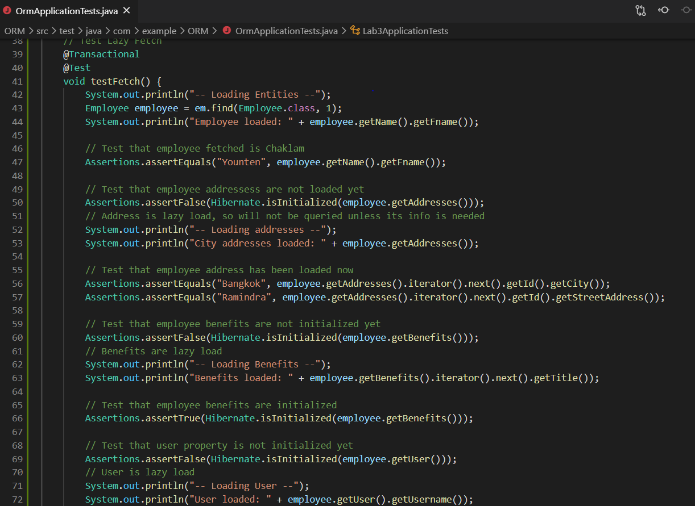

In Test Cache, ehcache.xml file have to get instance of a cache manager with cache name employee - Younten.

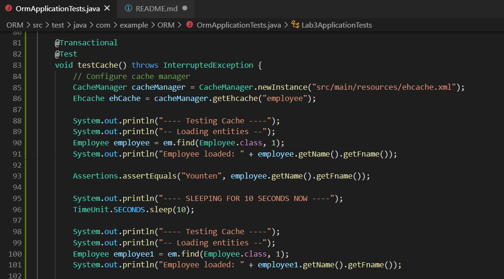

**Assertions.assertTrue(condition)** will check the size.

>## H. Coding: Attempt to extend the app so that user can apply sick leave or annual leave (do not make any fancy thing, simply add leave), and admin can approve leave.
**Answer:**

For the extended application follow the link given below:

https://github.com/YountenTshering/AT70.18_HomeWork/tree/master/Lab3_ExtendedApp

