># ORM, Hibernate, JPA, and Spring

> ORM using Hibernate, JPA, and Spring Boot.  These includes:

1. Caching (Identity Map)
2. OneToOne, OneToMany, ManyToOne, ManyToMany
3. Cascade
4. Lazy and Eager Load (**For big data and small scale respectively)**
5. Transient
6. EmbeddedId
7. MapsId
8. Inheritances

Here, we will be making an employee domain model with the following attributes:

- id as primary key
- Name
- age
- Addresses with **OneToMany** relationship
- Benefits with **ManyToMany** relationship 
- Leaves with **OneToMany** relationship (leave to annual leave or sick leave)
- User with **OneToOne** relationship (user to employee)

># Adding Dependencies

1. Create spring boot starter project with the following dependencies:

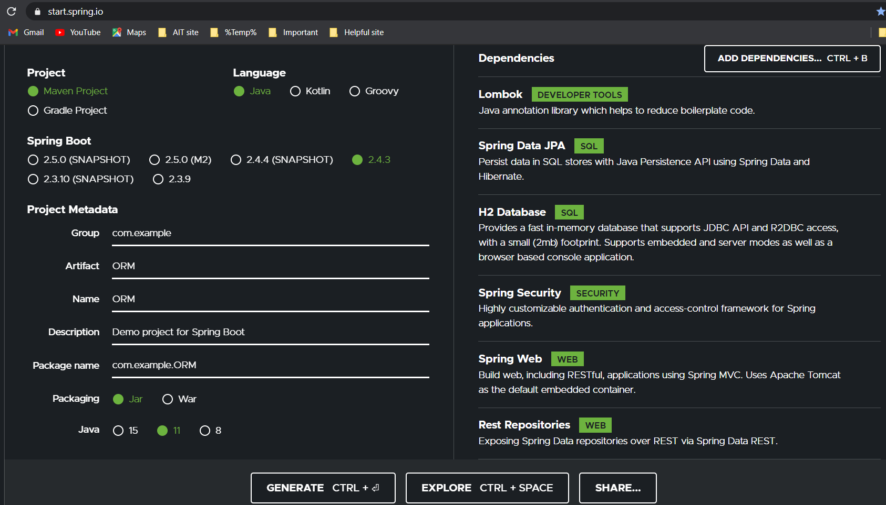

- Lombok - for reducing boilerplate code
- JPA - for repository pattern
- H2 - in-memory database
- Security - for providing authentication-authorization
- Spring Web - provides controllers and MVC support
- Rest Repo - provides restful controllers without implementing

>## Aside from these dependencies, make sure you install these additional dependencies from maven repositories as follows:

- hibernate-ehcache, which allows hibernate that comes with Spring Boot to work with a dependency called ehcache (make sure the **version matches** your hibernate-core version)
- ehcache - a dependency that enables 2nd level caching.  First level caching is provided by default which is an Identity Map implementation within a session.  
However, first-level caching will not persist across sessions/transactions.  If you would like it to persist, you are required to use 2nd level caching, which is not provided by default by hibernate.  There are many dependencies that can do this, one typical one is called **ehcache**.

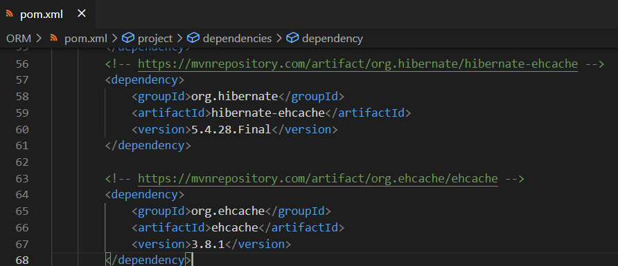

>## In application.properties

Set up the application.properties for your datasource

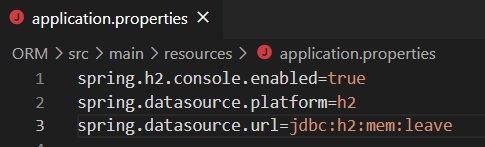

>## Adding Cache

1. We also have to inform our Hibernate to use 2nd level cache.  In addition, we will be using ENABLE_SELECTIVE in which cache only applies to those with @Cache and not all entities.  Last, we also want to make sure we inform hibernate the factory that will be performing the 2nd-level cache.

Note that it is not turn on query_cache, but if we want to try, we can certainly turn in on and use along with @QueryHints in the repository

2. For ease of development, turn on logging in hibernate.

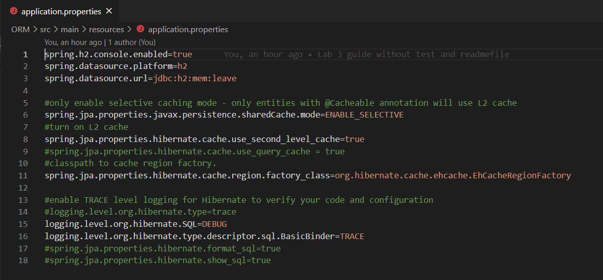

3. Let’s create our cache file, inside resources:

**Ehcache.xml**

- **DiskStore**: EHCache stores data into memory but when it starts overflowing, it starts writing data into the file system. We use this property to define the location where EHCache will write the overflown data.
  
- **defaultCache**: It’s a mandatory configuration, it is used when an Object need to be cached and there are no caching regions defined for that.  
For example, timeToLiveSeconds was set to 10, meaning that things will be kept in cache for 10 seconds.  Normally you would set higher numbers, but for demonstration, set it to a much lower number
- **cache name="employee"**: We can cache element to define the region (e.g., @Cache(usage....., region = "employee") and it’s configurations. We can define multiple regions and their properties, while defining model beans cache properties, we can also define region
with caching strategies. The cache properties are easy to understand and clear with the name.  This is optional, if not specified, defaultCache will be used.

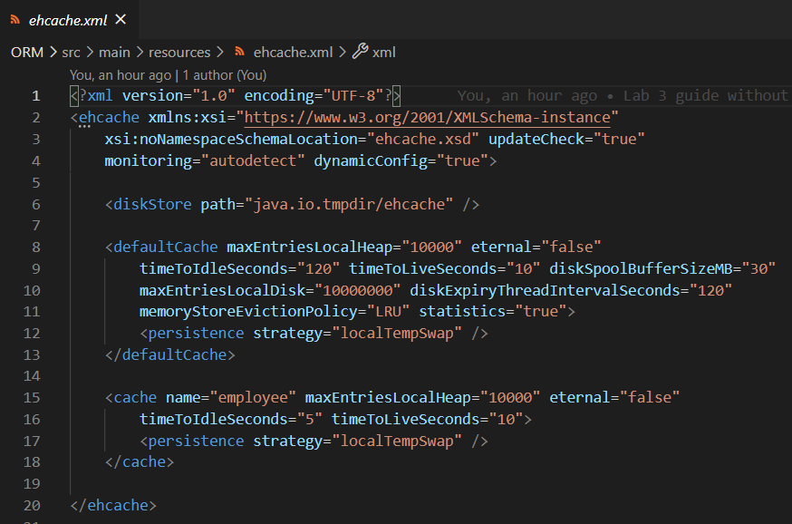

>## data.sql

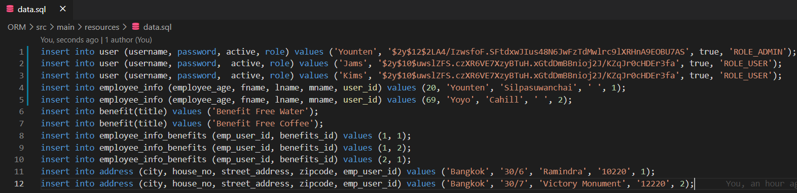

>## For code:

https://github.com/YountenTshering/AT70.18_HomeWork/tree/master/Lab3_guide/ORM

>## Creat a package **Models**

1. Now, let’s first create a **User.java**.  Notice that we added OneToOne mapping with employees.  Since when we remove user, we would also want to remove employee, we set **cascade** to all, and orphanRemoval to true

- Note the @Cacheable annotations on top, which tells hibernate to cache User, that is, whenever is loaded, it will be kept on the cache for a certain period of time as specified in the ehcache.xml.  Since no region is specified here, it will be using defaultCache
- Note the mappedBy attribute which means that employee will be the one owning this relationship, thus Employee table will have the foreign key
- Note that my User constructor has no id, since id will be auto-generated

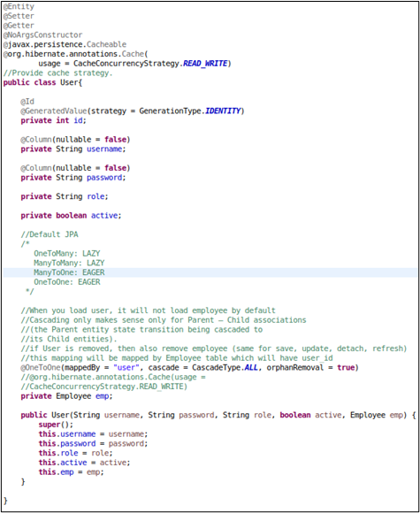

2. Next, let’s work on the **Address.java**

- Note the same cache annotations on top
- Note EmbeddedId. Here we are using a composite primary key, which the attributes are defined in a separate entity called AddressId. Any attributes inside EmbeddedId will be inserted into the same table as Address
- Note the ManyToOne, which we are using lazy load.  This means that when address is loaded, employee will not be loaded by default until someone called Addresses.getEmployee

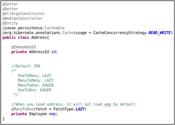

3. Let’s look at **AddressId.java**

- To tell spring that this is a embeddable id on the inverse side, you put @Embeddable
- Any composite key requires implementing Serializable, since when you load Address, you have to make all referenced objects serializable, i.e., allow these objects to decompose into bytes for effective transfer.
  
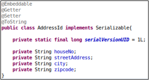

4. Let’s look at **Leave.java**, which is a parent of **SickLeave.java and AnnualLeave.java**.  This will help implement inheritance strategy

- Note @Inheritance using Single_Table strategy, which means that any child attributes shall be put into a single table along with the parent attributes.  Make sure you have only one @Id only at the parent side
- Note @DiscriminatorColumn which defines the name of the table column which helps discriminate between childs.  
- Note that I have included a column called LeaveType, which has the same column name as the discriminator name.  This is to tell hibernate that they are the same column.  This allows us to make sure our enum LeaveType is consistent with our discriminator column, instead of letting hibernate create its own discriminator value
- Since LeaveType can only be specified by child (i.e., SickLeave or AnnualLeave), we need to set insertable and updatable to false
- Since we are using LocalDate, you would anticipate that we have a LocalDate converter.  See github for the converter code
- @Enumerated(String) helps convert enum to String based on name

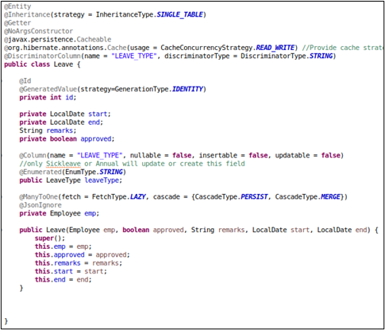

5. Let’s implement **SickLeave.java**

- @DiscriminatorValue is used to set the value of the column when this entity is created.  By default, it uses the class name

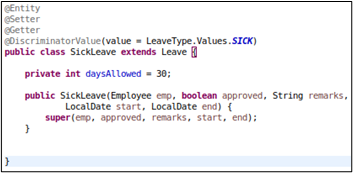

6. Implement **AnnualLeave.java**

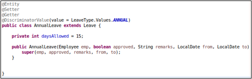

7. **LeaveType.java**

- Notice I have created a constructor for this enum, which helps convert enum to String, since DiscriminatorValue only accepts String

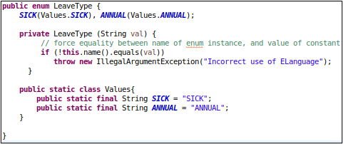

8. **Benefit.java** is a straightforward model

- Since it’s a ManyToMany relationship, using Set is much better
- Since the mappedBy is here, it means we inform hibernate that Employee will be the owning side, and thus the resulting intermediate table will be EMPLOYEE_BENEFITS instead of BENEFITS_EMPLOYEE (trivial for those who want to know)
- Since by default, ToMany side will be lazy load, we do not have to specify any lazy initialization

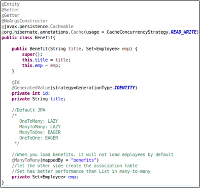

9. We shall now focus on the employee class. But let’s make the **Name.java**. To make employee name elegant, we shall create an @Embeddable Name, containing fname, lname, and mname

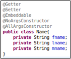

10.	Now we are ready to work on our **Employee.java** class

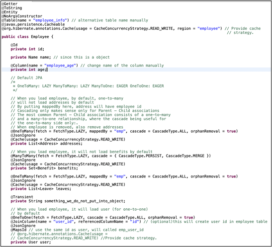

- @Table allows us to explicitly specify the name we want.  By default, it uses the class name
- @MapsId allows us to use the same id as User.  Since we are going to use the same id as User.java, we will not include GeneratedValue in the id field
- @Column allows us to explicitly specify the column name
- By default, ehcache does not cache collections, thus in ToMany associations, we have to explicitly specify the @cache
- @JsonIgnore helps in infinite recursion.  For more details, refer to (https://www.baeldung.com/jackson-bidirectional-relationships-and-infinite-recursion)
- @Transient demonstrates attributes that does not require mapping to the database

>## The directory structure at the end is like:

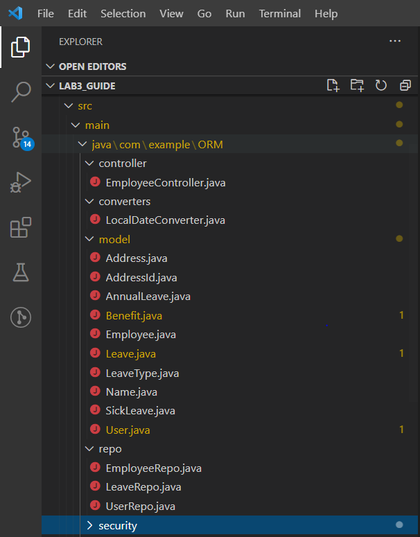
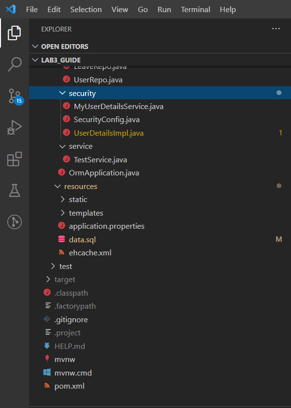

>## For Testing

1. Tests are written inside TestService.java.  The code can be found in the following link.

https://github.com/YountenTshering/AT70.18_HomeWork/blob/master/Lab3_guide/ORM/src/main/java/com/example/ORM/service/TestService.java

2. The main program will be using the service. The code can be found in the following link.

https://github.com/YountenTshering/AT70.18_HomeWork/blob/master/Lab3_guide/ORM/src/main/java/com/example/ORM/OrmApplication.java

># Output:

> When you run the application the table will be created as followed:

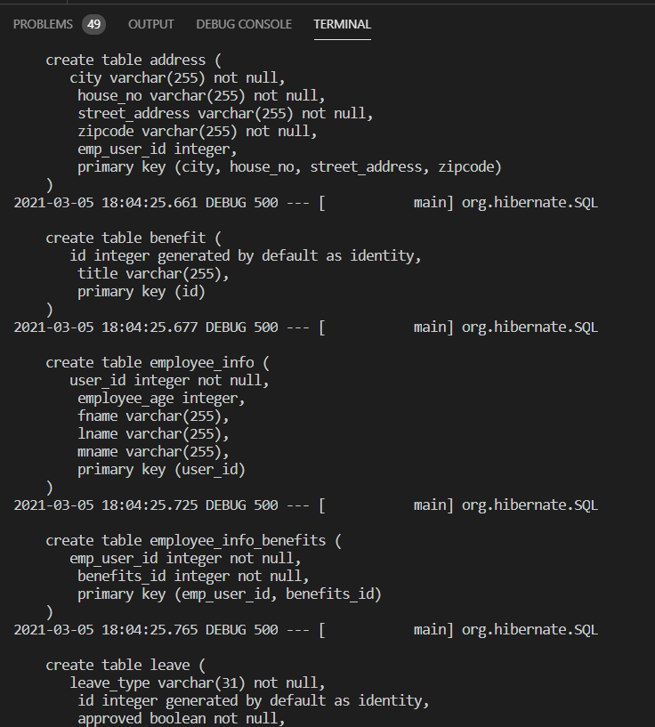

> Then the constraint and relationship will be created.

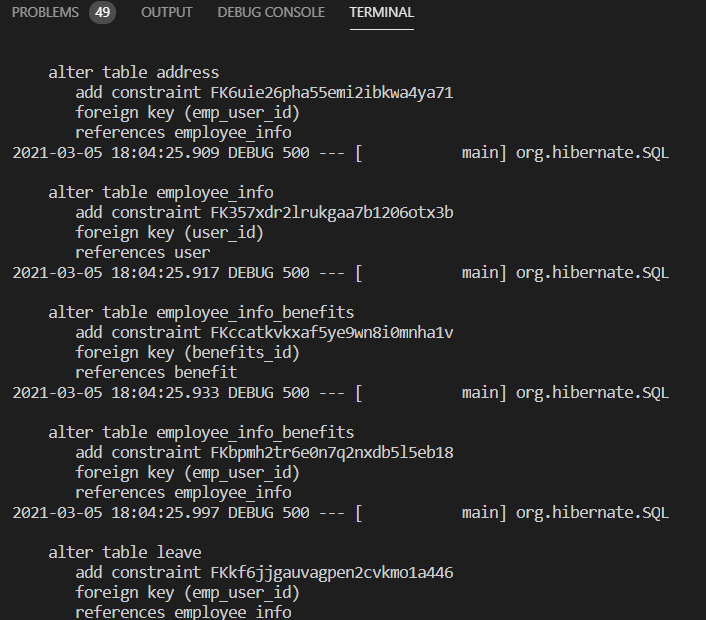

> After that data are fetch into table and loaded.

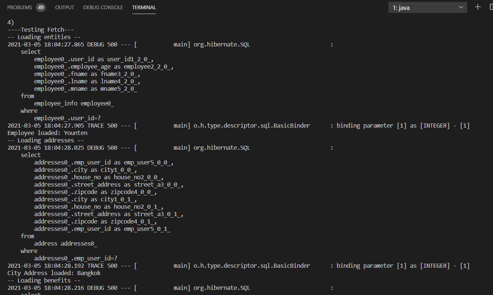

> Testing Cache depending with cache time and loading happens when cache time is within sleep time.

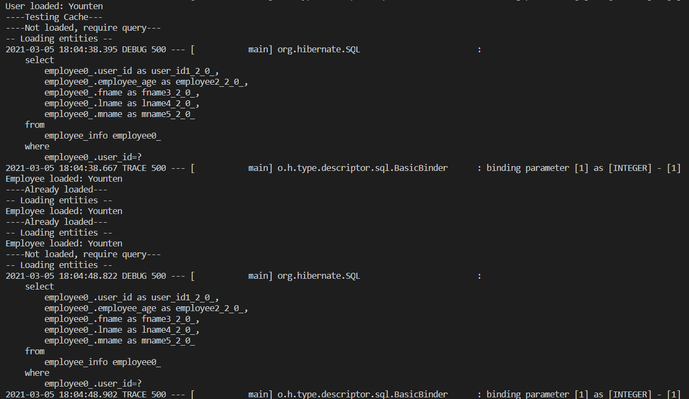

> Localhost will have login form for employee.

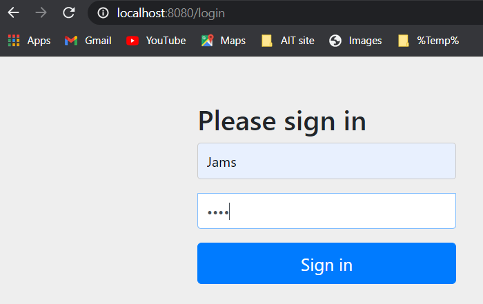

> We can access the h2 database using h2-console

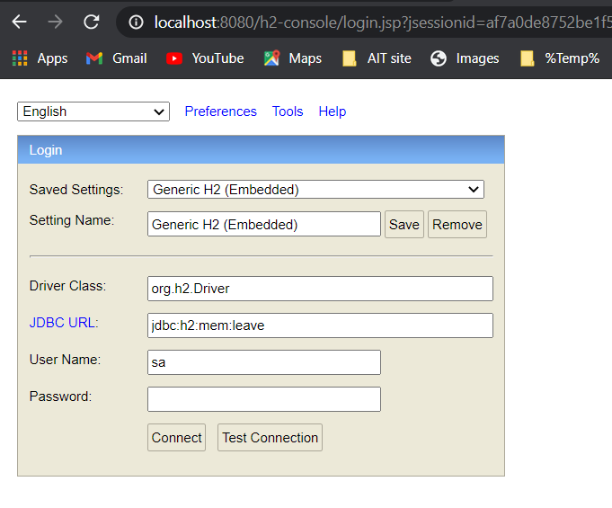

> Check the leave table and see what we have done.

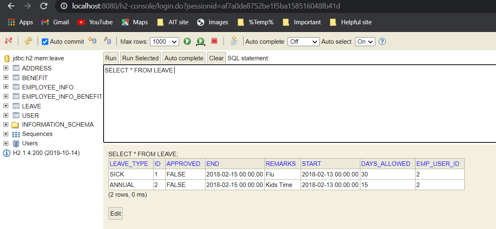

