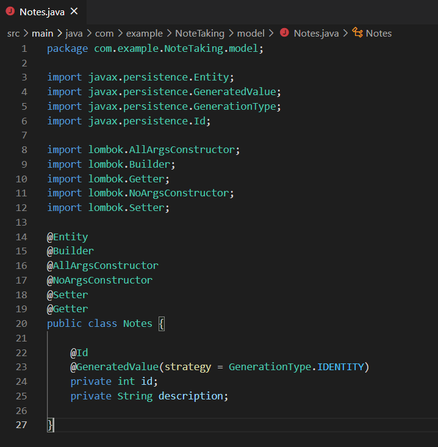

># Microservices + Kubernetes

We will be able to launch a local Kubernetes cluster, develop an app using Spring Boot, and deploy it as a container in Kubernetes.

># Simple note-taking app

># Adding Dependencies

Generated project from https://start.spring.io/

1.	Create your spring boot starter project (NoteTaking) with the following dependencies:

- Web
- Actuator - provide health endpoints for application. For example, the health endpoint provides basic application health information.
- Thymeleaf - templating engine for HTMLs.  Better than JSP in all aspects as it doesn't mix logic.  Works well with javascript frameworks like Angular.  
- H2
- Lombok
- Spring Data JPA
 

Coordinates for core library:

># application.properties

In the **application.properties**, add:

 
># Models

Let’s create an entity called **Note.java**

># Controllers

1. Let’s create controller which has method to retrieve all notes (the **reverse method** is for showing the most recent one first)

1. Let’s also create method for **saving notes**

1. We shall also create a route for **invoking** the get and save method.  Here is the full implementation of the controller

># Views

1. **Add the index.html in src/main/resources/templates** and run the Spring Boot app.  Now we should be able see notes to save.

># index page

># output:

When you run the app, you should be **able to save notes into the database**:

># Database after saving the note:

