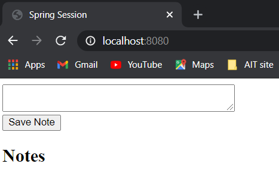
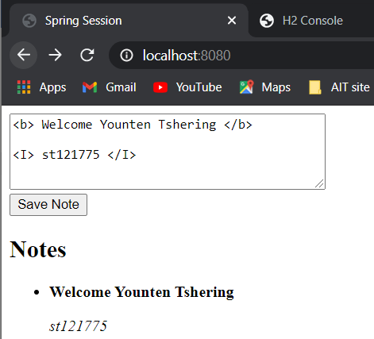
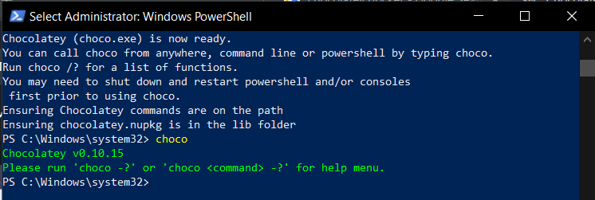
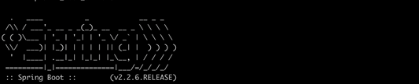

># Microservices + Kubernetes

We will be able to launch a local Kubernetes cluster, develop an app using Spring Boot, and deploy it as a container in Kubernetes.

># Simple note-taking app

># Adding Dependencies

Generated project from https://start.spring.io/

1.	Create your spring boot starter project (NoteTaking) with the following dependencies:

- Web
- Actuator - provide health endpoints for application. For example, the health endpoint provides basic application health information.
- Thymeleaf - templating engine for HTMLs.  Better than JSP in all aspects as it doesn't mix logic.  Works well with javascript frameworks like Angular.  
- H2
- Lombok
- Spring Data JPA
 

Coordinates for core library:

># application.properties

In the **application.properties**, add:

 
># Models

Let’s create an entity called **Note.java**

># Controllers

1. Let’s create controller which has method to retrieve all notes (the **reverse method** is for showing the most recent one first)

1. Let’s also create method for **saving notes**

1. We shall also create a route for **invoking** the get and save method.  Here is the full implementation of the controller

># Views

1. **Add the index.html in src/main/resources/templates** and run the Spring Boot app.  Now we should be able see notes to save.

># index page

># Output:

When you run the app, you should be **able to save notes into the database**:

># H2 after saving the note:

># Making a executable jar file
 
Before we will containerize our app:
- Make a jar file so it can be containerized.
- In VScode, we need to install the extension
- Select main file, and build jar.

> - Run command palette Ctrl+Shift+P
> - Type Build Jar

A folder called build-jar will be created in your workspace with the .jar file and compiled .class files

># Docker Container

So let’s containerize our app.  Containterize refers to packaging this app, so that it can run independently of the environment.

># 1. First of all, you have to install Docker.

> Using chocolate way:

Follow the link to install choco: https://chocolatey.org/install

After reading the steps, follow the steps to get choco in windows.

> After the chcolatey is installed, then we need to installl docker in choco follow the link below:
https://chocolatey.org/packages/docker-for-windows

After running the command, the docker is install with path. If the path is not define then we need to do it to where the docker folder is created(docker.exe).

> Another way is using docker desktop, Download and simple install.

># 2. Ultimately, we have to verify that Docker is installed correctly with the following command:
`docker run hello-world`

># 3. To run docker, we need a Dockerfile. Go to the root of your app, create the Dockerfile (same level as pom.xml and without any extension).

The above Dockerfile includes the following commands:

- **FROM** defines the base layer for the container, in this case, a version of OpenJDK 11
- **WORKDIR** sets the working directory to /opt/. Every subsequent instruction runs from within that folder
- **ENV** is used to set an environment variable
- **COPY** copies the jar files from the /target/ into the /opt/ directory inside the container
- **ENTRYPOINT** executes java $JAVA_OPTS -jar app.jar inside the container

># 4. To run the file, traverse to your directory where the Dockerfile is. Run the following command: 
`docker build -t note-java .`
> Don’t forget the dot! Note the following about above command:

- **-t note-java** defines the name ("tag") of your container — in this case, our container is just called note-java
- **.** is the location of the Dockerfile and application code — in this case, it's the current directory
- This is how it looks.  Your response will be longer. 

> After build

># 5. Type **docker images** to list all docker images.  
You should see the **note-java image** that you just built. You can also see **hello-world** which is automatically downloaded when you first do docker run hello-world 

># 6. To run the docker image, type **docker run --name=note-java -p 8080:8080 note-java**
Note the following about this command:
- **--name** defines the name for the container
- **-p 8080:8080** publishes port 8080 of the container to port 8080 of our local machine. That means, if we access port 8080 on our computer, the request is forwarded to port 8080 of the note container. You can use the forwarding to access the app from our local machine.

# Give access

># 7. Now we can see similar processes just like we run Spring Boot, and  see the app in localhost:8080

># Adding to docker repositories

1. Let’s upload our container image to a container repository for archival

> a. To use Docker Hub, first we have to create a Docker ID.   After you sign in, you will see that you have no repositories.

> b. Then go back to your command, to login, do docker login

> c. Images uploaded to Docker Hub must have a name of the form username/image:tag:
- **username** is our Docker ID
- **image** is the name of the image
- **tag** is an optional additional attribute — often it is used to indicate the version of the image

> d. To rename your image according to this format, run the following command (replace username with your username):  

`docker tag note-java <username>/note-java:1.0.0`

> e. Now you can upload your image to Docker hub

`docker push <username>/note-java:1.0.0`
 

Now, we can go to the docker hub website, see our image being pushed

> f. Before we can run from the docker hub, let’s stop the previous one that we have deployed.  Even it is Exited, but since we have run, it remains in the registry.  You can see it by typing:

`docker ps -a`
 

**Note**: anything that it’s here, when the status is **Exited**, You can always start it by typing **docker start note-java** 

**For example** note that **run** means deploying the container, while start means running stopped containers.
Here, even if nothing comes up, you can go to localhost:8080 and see the app running.

> g. So let’s make sure we stop everything

i.	**docker stop note-java**  //stopping the image

ii.	**docker rm note-java** //removing it from the registry

> h. To verify the docker hub connection with the image works, type **docker run --name=note-java -p 8080:8080 <username>/note-java:1.0.0**

 

># Deploying to kubernetes
Kubernetes has many cluster and use minikube-cluster

> 1. Now, we will work with Kubernetes.  Here we will use Minikube.  Minikube creates a single-node Kubernetes cluster running in a virtual machine.   A Minikube cluster is mostly intended for testing purposes (you may want to use Amazon Elastic Kubernetes or Google Kubernetes Service for production).  

Before we install Minikube, we have to install **kubectl**.  
- Install kubectl on Windows

The following methods exist for installing kubectl on Windows:
- Install kubectl binary with curl on Windows
- Install with PowerShell from PSGallery
- **Install on Windows using Chocolatey or Scoop** (method used)
- Install on Windows as part of the Google Cloud SDK

https://kubernetes.io/docs/tasks/tools/install-kubectl-windows/#install-on-windows-using-chocolatey-or-scoop

After you have followed the documentation, to ensure the version you installed, type **kubectl version --client** 

> 2. **kubectl** is the primary Kubernetes CLI — use it for all interactions with a Kubernetes cluster.

> 3. Once **kubectl** is installed, **install Minikube** according to the **official documentation**.  

https://minikube.sigs.k8s.io/docs/start/

 > With Minikube installed, we can create a cluster by typing **minikube start**

> 4. First of all, create a folder named kube in your application directory.  The purpose of this folder is to hold all the Kubernetes YAML files that we will create.  The first Kubernetes resource is a Deployment.  Here is the definition of the Deployment file
kube/note.yaml

The first four lines define the type of resource (**Deployment**), the version of this resource type **(apps/v1)**, and the name of this specific resource (**note**).  Next, we have the desired number of replicas.   We don't usually talk using the term  “containers” in Kubernetes, instead we talk using the term “Pods”.  

A Pod is a wrapper around one or more containers.  Most often, a Pod contains only a single container — however, for advanced use cases, a Pod may contain multiple containers.  If a Pod contains multiple containers, they are treated by Kubernetes as a unit — for example, they are started and stopped together and executed on the same node.  A Pod is the smallest unit of deployment in Kubernetes — you never work with containers directly, but with Pods that wrap containers.

The second part is the Service resource.  It defines the available service accessible from outside the cluster.  The first part is the selector according to their labels - this should correspond exactly to what we specified in our Deployment resource template/metadata>labels>app which is note.

> 5. Now make sure that our Minikube cluster is running by typing **minikube status**

If not running, type “minikube start”

> 6. Then apply the resource definition with the following command **kubectl apply -f kube**

The command submits all the YAML files in the kube directory to Kubernetes, and will create Pods.  Check that the pods are created successfully by typing **kubectl get pods**

 

Also type **kubectl get svc** (svc for service)

 

7.	To launch our app, simply run **minikube service note**

 

Automatically the app will be launched.

 

> Finally everything is done, making a simple Kubernetes app.

Thank you